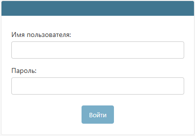
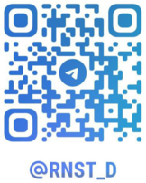

# Начинаем работу с QR-Passport
Данная инструкция содержит всю необходимую информацию для освоения системы и эффективной работы с QR-Passport.

<!--

Интерфейс системы будет выглядеть по-разному в зависимости от прав доступа (_подробнее о правах доступа см. [пользователи](company/users.md#anchor)_).

-->

## Порядок изучения

1. Раздел [Быстрый старт](quick_start.md) знакомит с основными принципами работы на практическом примере.

2. Последующие разделы содержат детальное описание функционала для углубленного изучения.

<!--## Вход в систему

1. Перейдите по [ссылке](https://qrpassport.app/admin). 

2. Для входа в систему используйте учетные данные, направленные администратором QR-Passport после обработки заявки на сайте.

-->

## Техническая поддержка

Если возникнут трудности — мы на связи. Выберите удобный способ:

  <a href="mailto:info@qrpassport.tech" class="contact-card">
    
    
<strong>Email</strong> info@qrpassport.tech

  </a>
  <a href="https://max.ru/u/f9LHodD0cOJtyuTGaqVohFwY9J_oThzVp6dTDYOtiMee5uMTvVtQVub2BWM" class="contact-card" target="_blank">
    
    
<strong>MAX</strong> Написать в мессенджере

  </a>
  <a href="https://t.me/ya_rozaliya" class="contact-card" target="_blank">
    
    
<strong>Telegram</strong> @ya_rozaliya

  </a>

<!--|  Розалия  |  Эрнест  |
|:---------:|:--------:|
|||-->

