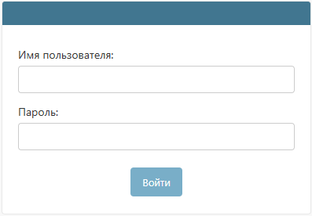
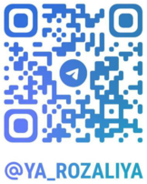
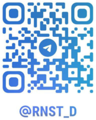

  <a href="/ru/">Главная</a> / 	
Начало работы

# Начинаем работу с QR-Passport
Данная инструкция содержит всю необходимую информацию для освоения системы и эффективной работы с QR-Passport.



Если вы впервые работаете в QR-Passport, начните с примера под ваш вид изделия. Последующие разделы содержат детальное описание функционала для самостоятельного изучения.



## Трубопроводная арматура

Чтобы выпустить паспорт на трубопроводную арматуру:

1. [**Добавьте марку материала**](https://docs.qrpassport.tech/ru/equipment/material_grades/about.html#sozdanie-marki-materiala) – химический состав и механические свойства
2. [**Добавьте сертификат**](https://docs.qrpassport.tech/ru/equipment/certificates/about.html#sozdanie-sertifikata) – с партией/плавкой
3. [**Создайте деталь**](https://docs.qrpassport.tech/ru/equipment/details/about.html#sozdanie-detali) – она свяжет модель с материалом
4. [**Создайте модель**](https://docs.qrpassport.tech/ru/equipment/models/create_model.html#forma-sozdaniya-modeli)
5. [**Настройте шаблон паспорта**](https://docs.qrpassport.tech/ru/equipment/models/templates.html#dobavlenie-shablona)
6. [**Зарегистрируйте изделие**](https://docs.qrpassport.tech/ru/equipment/registered_products/about.html#registraciya-izdeliya)
7. [**Скачайте паспорт и QR-код**](https://docs.qrpassport.tech/ru/equipment/registered_products/about.html#dejstviya-s-izdeliyami-v-spiske)



Пошаговый пример – в **[Практическом руководстве](quick_start.md)**.



---

## Пневмоприводы, электроприводы и другое оборудование

Для остального оборудования путь короче:

1. [**Создайте модель**](https://docs.qrpassport.tech/ru/equipment/models/create_model.html#forma-sozdaniya-modeli)
2. [**Настройте шаблон паспорта**](https://docs.qrpassport.tech/ru/equipment/models/templates.html#dobavlenie-shablona)
3. [**Зарегистрируйте изделие**](https://docs.qrpassport.tech/ru/equipment/registered_products/about.html#registraciya-izdeliya)
4. [**Скачайте паспорт и QR-код**](https://docs.qrpassport.tech/ru/equipment/registered_products/about.html#dejstviya-s-izdeliyami-v-spiske)



Пошаговый пример – в разделе **[Быстрый старт](quick_start_other.md)**.



<!--## Вход в систему

1. Перейдите по [ссылке](https://qrpassport.app/admin). 

2. Для входа в систему используйте учетные данные, направленные администратором QR-Passport после обработки заявки на сайте.

-->

<!--## Техническая поддержка

Если возникнут трудности – мы на связи. 
Выберите удобный способ:

  <a href="mailto:info@qrpassport.tech" class="contact-card">
    <svg xmlns="http://www.w3.org/2000/svg" width="28" height="28" viewBox="0 0 24 24" fill="none" stroke="currentColor" stroke-width="2" stroke-linecap="round" stroke-linejoin="round"><rect width="20" height="16" x="2" y="4" rx="2"/><path d="m22 7-8.97 5.7a1.94 1.94 0 0 1-2.06 0L2 7"/></svg>
    
<strong>Email</strong> info@qrpassport.tech

  </a>
  <a href="https://max.ru/u/f9LHodD0cOJtyuTGaqVohFwY9J_oThzVp6dTDYOtiMee5uMTvVtQVub2BWM" class="contact-card" target="_blank">
    <svg xmlns="http://www.w3.org/2000/svg" width="28" height="28" viewBox="0 0 24 24" fill="none" stroke="currentColor" stroke-width="2" stroke-linecap="round" stroke-linejoin="round"><path d="M7.9 20A9 9 0 1 0 4 16.1L2 22Z"/></svg>
    
<strong>MAX</strong> Написать в мессенджере

  </a>
  <a href="https://t.me/ya_rozaliya" class="contact-card" target="_blank">
    <svg xmlns="http://www.w3.org/2000/svg" width="28" height="28" viewBox="0 0 24 24" fill="none" stroke="currentColor" stroke-width="2" stroke-linecap="round" stroke-linejoin="round"><path d="m22 2-7 20-4-9-9-4Z"/><path d="M22 2 11 13"/></svg>
    
<strong>Telegram</strong> Написать в мессенджере

  </a>

<!--|  Розалия  |  Эрнест  |
|:---------:|:--------:|
|||-->

