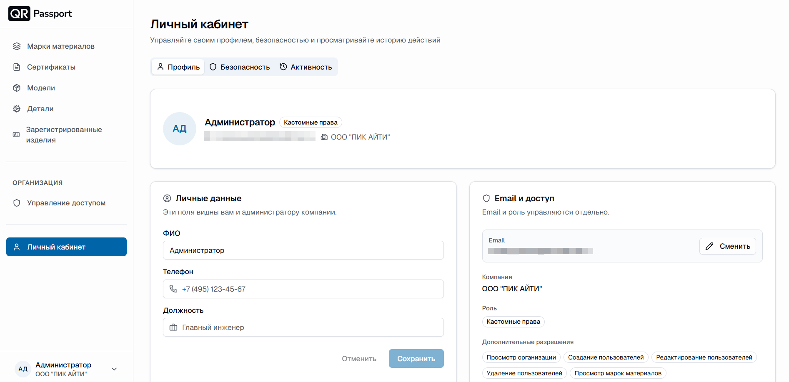
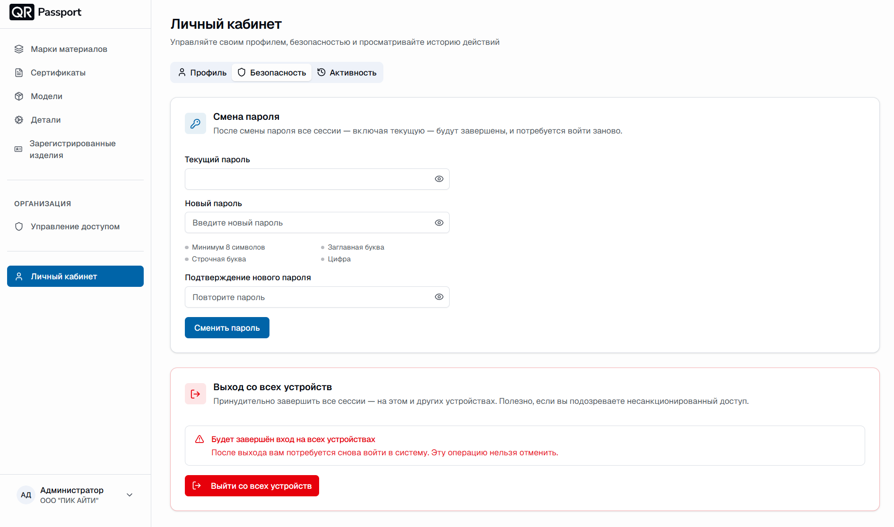
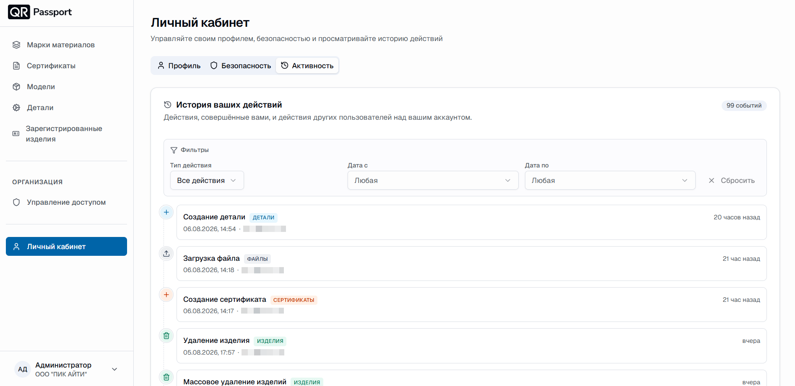

  <a href="/ru/">Главная</a> / Личный кабинет

# Личный кабинет

В личном кабинете вы управляете своим профилем, безопасностью аккаунта и просматриваете историю действий. Раздел состоит из трех вкладок: **«Профиль»**, **«Безопасность»** и **«Активность»**.

## Вкладка «Профиль»

В верхней части карточки отображаются ваши имя, роль и компания.

### Личные данные

Здесь можно заполнить или изменить ФИО, телефон и должность. Эти поля видны вам и администратору компании. После ввода нажмите **«Сохранить»**; кнопка **«Отменить»** сбрасывает несохраненные изменения.

### Email и доступ

Email и роль управляются отдельно:

- **Email** – нажмите **«Сменить»**, чтобы обновить адрес;
- **Компания** – организация, к которой вы подключены;
- **Роль** – ваша текущая роль;
- **Дополнительные разрешения** – индивидуальные разрешения, которые входят в вашу роль.

## Вкладка «Безопасность»

### Смена пароля

1. Введите **текущий пароль**.
2. Введите **новый пароль**. Требования: минимум 8 символов, заглавная и строчная буквы, хотя бы одна цифра.
3. Повторите новый пароль в поле **подтверждения**.
4. Нажмите **«Сменить пароль»**.

После смены пароля все сессии – включая текущую – завершатся, и потребуется войти заново.

### Выход со всех устройств

Кнопка **«Выйти со всех устройств»** принудительно завершает все сессии на этом и других устройствах. Это полезно, если вы подозреваете несанкционированный доступ к аккаунту. Операция необратима: после выхода нужно войти в систему снова.

## Вкладка «Активность»

Здесь отображается история **ваших** действий в системе. Для каждого события указываются тип, дата и время.

Список можно фильтровать по **типу действия** и **периоду** (дата с / дата по); кнопка **«Сбросить»** очищает фильтры.