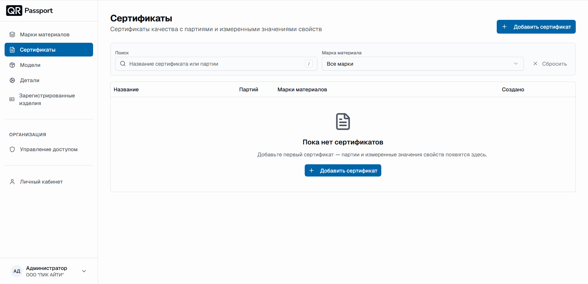
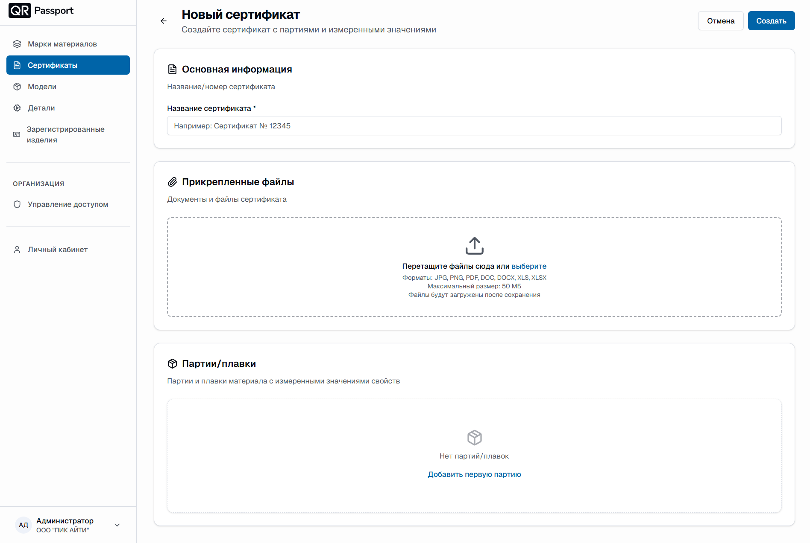
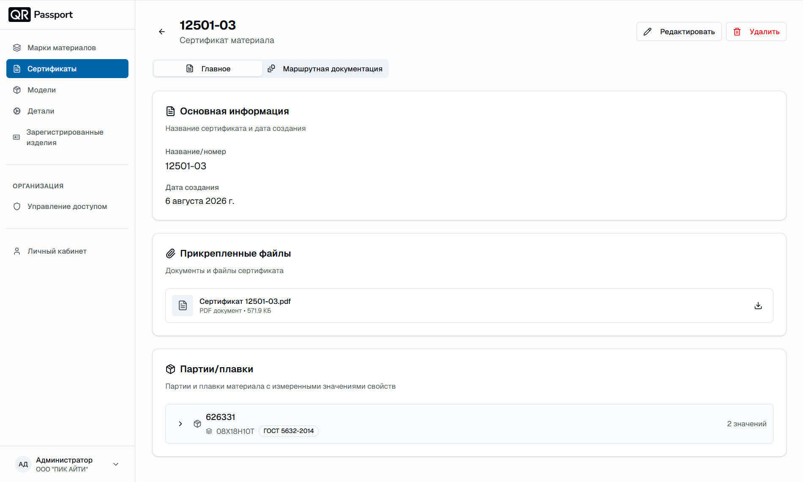

  <a href="/QR-Passport/ru/">Главная</a> / Сертификаты

# Сертификаты

Раздел «Сертификаты» хранит сертификаты качества с партиями и измеренными значениями свойств. Сертификат связывает вместе файл документа, партии/плавки материала и результаты измерений.

В разделе вы можете:

- просматривать список сертификатов;
- искать сертификат по названию сертификата или партии;
- отбирать сертификаты по марке материала;
- создавать, редактировать и удалять сертификаты.

## Внешний вид раздела

В таблице сертификатов отображаются:

1. **Название** – название/номер сертификата.
2. **Партий** – количество партий/плавок в сертификате.
3. **Марки материалов** – марки материалов, использованные в партиях.
4. **Создано** – дата создания сертификата.

Кнопка «Сбросить» очищает поиск и фильтр по марке материала.

## Создание сертификата

1. Нажмите кнопку **«Добавить сертификат»**.
2. В блоке «Основная информация» укажите название/номер сертификата.
3. Прикрепите файлы сертификата в блоке «Прикрепленные файлы».
4. Добавьте [партии/плавки](batches_heats.md) с измеренными значениями свойств.
5. Нажмите **«Создать»**.

### Прикрепленные файлы

Перетащите файлы в область загрузки или нажмите «выберите», чтобы выбрать их с диска.

- Форматы: JPG, PNG, PDF, DOC, DOCX, XLS, XLSX.
- Максимальный размер: 50 МБ.
- Файлы загружаются после сохранения сертификата.

## Просмотр сертификата

Откройте сертификат из списка. На странице сертификата доступны две вкладки:

- **«Главное»** – основная информация, прикреплённые файлы и партии/плавки;
- **«Маршрутная документация»** – маршрутная документация по сертификату.

В блоке «Основная информация» отображаются название/номер и дата создания сертификата. Прикреплённые файлы можно скачать кнопкой загрузки напротив файла. Карточки партий/плавок показывают номер партии, марку материала с ГОСТ и количество измеренных значений.

Кнопки в правом верхнем углу страницы:

- **«Редактировать»** – изменение данных сертификата;
- **«Удалить»** – удаление сертификата с подтверждением.