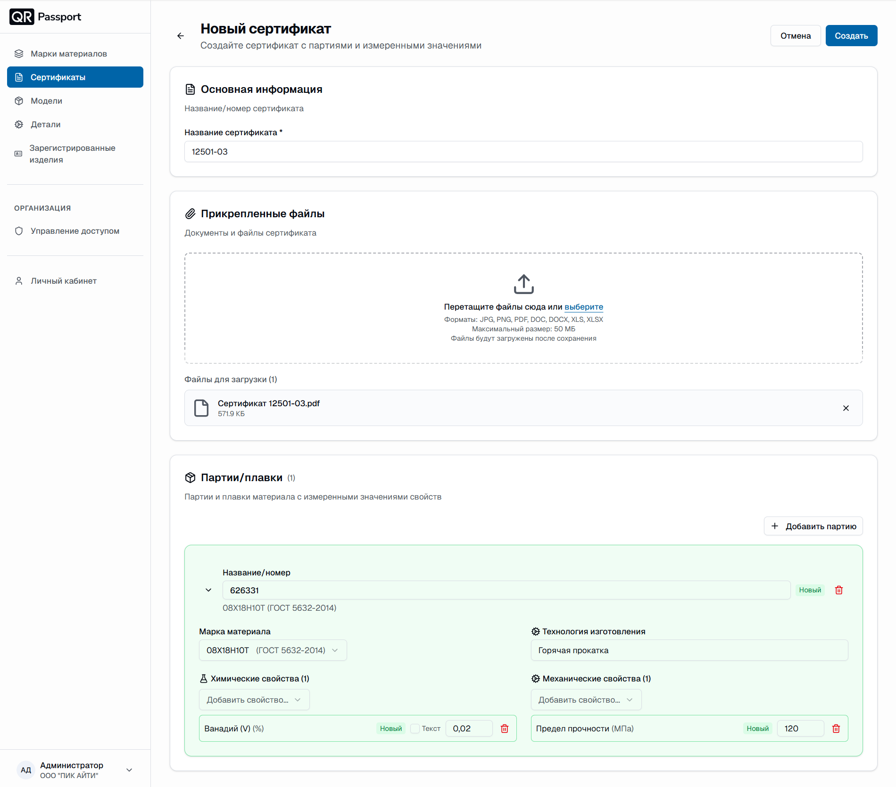

  <a href="/ru/">Главная</a> / Партии/плавки

# Партии/плавки

Партия/плавка – это партия материала с измеренными значениями свойств. Каждая партия привязывается к марке материала и технологии изготовления, а её значения попадают в карточку сертификата.

## Добавление партии/плавки

1. В форме сертификата в блоке «Партии/плавки» нажмите **«Добавить партию»** (для первой партии – «Добавить первую партию»).
2. Заполните карточку партии:
   - **Название/номер** – номер партии или плавки;
   - **Марка материала** – выберите марку из списка созданных в разделе «Марки материалов»;
   - **Технология изготовления** – технология, для которой указаны механические свойства;
   - **Химические свойства** – добавьте измеренные значения химического состава;
   - **Механические свойства** – добавьте измеренные значения механических свойств.
3. При необходимости добавьте остальные партии кнопкой «Добавить партию».

## Значения свойств

- Числовые значения вводятся в поле рядом с названием свойства – например, `0,02` для «Ванадий (V) (%)» или `120` для «Предел прочности (МПа)».
- Если значение не числовое, включите переключатель **«Текст»** у свойства.



После сохранения сертификата партии/плавки отображаются на странице сертификата: номер партии, марка материала с ГОСТ и количество измеренных значений. Раскройте карточку партии, чтобы посмотреть все значения.



