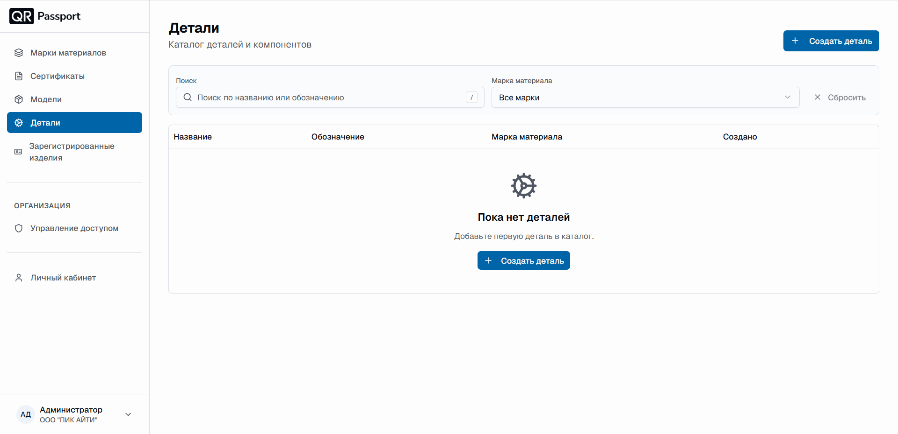
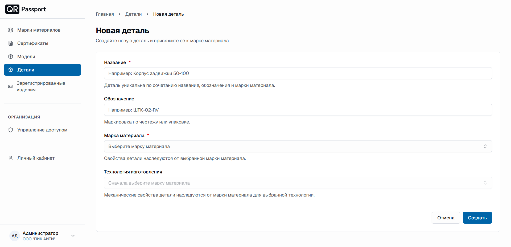
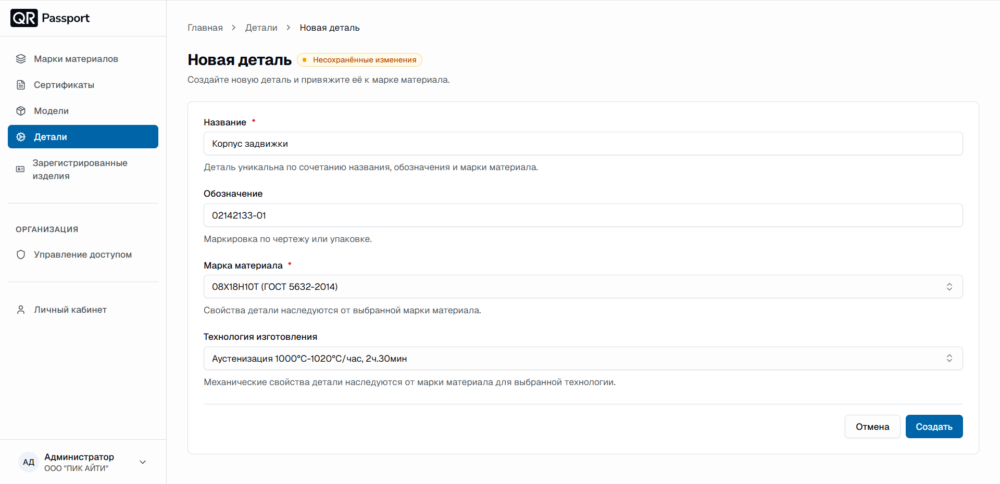
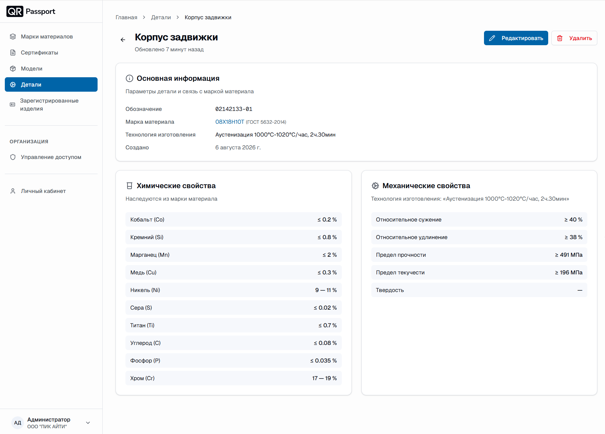

# Детали

Раздел «Детали» — это каталог деталей и компонентов. Каждая деталь привязывается к марке материала и технологии изготовления и наследует их химические и механические свойства.

В разделе вы можете:

- просматривать список деталей;
- искать деталь по названию или обозначению;
- отбирать детали по марке материала;
- создавать, редактировать и удалять детали.

## Внешний вид раздела

В таблице деталей отображаются:

1. **Название** — наименование детали.
2. **Обозначение** — маркировка по чертежу или упаковке.
3. **Марка материала** — марка, к которой привязана деталь.
4. **Создано** — дата создания детали.

Кнопка «Сбросить» очищает поиск и фильтр по марке материала.

## Создание детали

1. Нажмите кнопку **«Создать деталь»**.
2. Заполните поля формы:
   - **Название** — например, «Корпус задвижки 50-100». Деталь уникальна по сочетанию названия, обозначения и марки материала;
   - **Обозначение** — маркировка по чертежу или упаковке, например «ШТК-02-RV»;
   - **Марка материала** — выберите марку из списка. Свойства детали наследуются от выбранной марки материала;
   - **Технология изготовления** — становится доступна после выбора марки. Механические свойства детали наследуются от марки материала для выбранной технологии.
3. Нажмите **«Создать»**.

Пока марка материала не выбрана, поле «Технология изготовления» неактивно с подсказкой «Сначала выберите марку материала».

## Страница детали

Откройте деталь из списка — на её странице отображаются параметры детали и унаследованные свойства.

Страница состоит из блоков:

- **Основная информация** — обозначение, марка материала (ссылка на страницу марки), технология изготовления и дата создания;
- **Химические свойства** — наследуются из марки материала;
- **Механические свойства** — наследуются из марки материала для выбранной технологии изготовления.

Кнопки в правом верхнем углу страницы:

- **«Редактировать»** — изменение данных детали;
- **«Удалить»** — удаление детали с подтверждением.