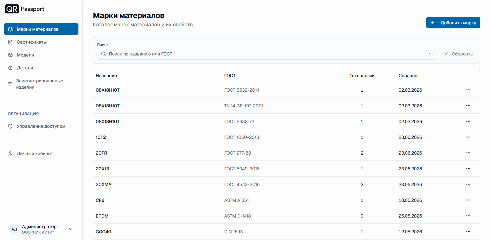
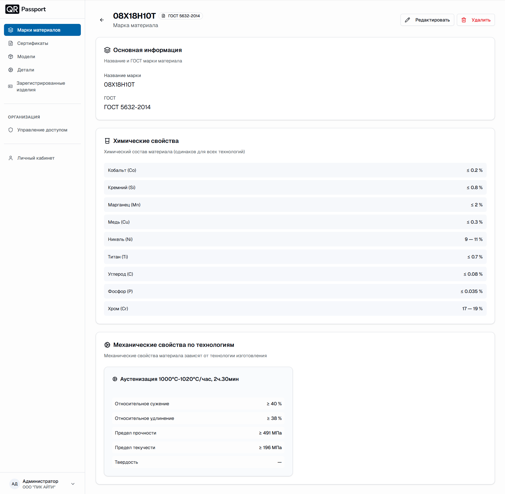

# Марки материалов

Раздел «Марки материалов» – это каталог всех марок материалов, доступных в системе QR-Passport. Марка материала хранит название, ГОСТ, химический состав и механические свойства по технологиям изготовления и используется при создании моделей оборудования.

В разделе вы можете:

- просматривать список марок материалов;
- искать марку по названию или ГОСТ;
- создавать новые марки материалов;
- редактировать и удалять марки.

## Внешний вид раздела

В таблице марок отображаются:

1. **Название** – наименование марки материала.
2. **ГОСТ** – нормативный документ марки.
3. **Технологии** – количество технологий изготовления, для которых определены механические свойства.
4. **Создано** – дата создания марки.
5. (**⋯**) кнопка действий – редактирование и удаление марки.



Для быстрого поиска используйте поле «Поиск по названию или ГОСТ»; кнопка «Сбросить» очищает фильтр.



## Создание марки материала

1. Нажмите кнопку **«Добавить марку»**.
2. В блоке «Основная информация» заполните поля:
   - **Название марки** – например, «Сталь 09Г2С»;
   - **ГОСТ** – например, «ГОСТ 19281-2014».
3. Добавьте [химические свойства](chemical_properties.md) материала.
4. Добавьте технологии и [механические свойства](mechanical_properties.md).
5. Нажмите **«Создать»**.



Кнопка «Отмена» возвращает к списку марок без сохранения изменений.



## Просмотр марки материала

Откройте марку из списка – на странице марки отображаются основная информация, химический состав и механические свойства по технологиям изготовления.

Кнопки в правом верхнем углу страницы:

- **«Редактировать»** – изменение данных марки;
- **«Удалить»** – удаление марки с подтверждением.