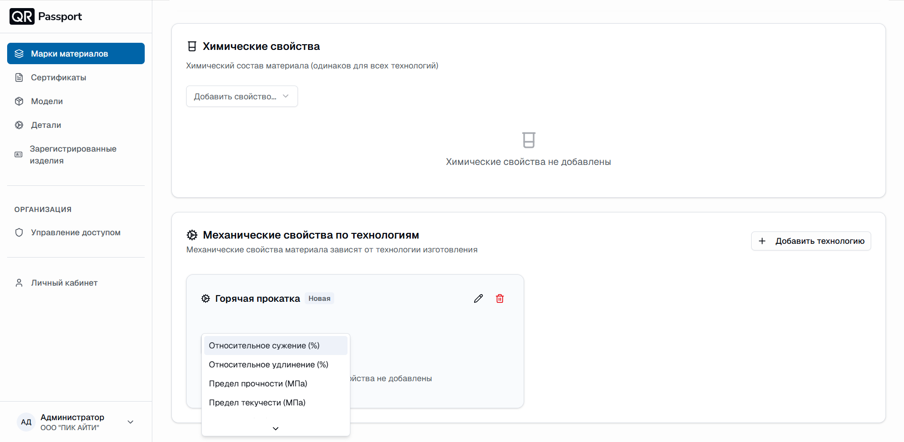

# Механические свойства

Механические свойства материала зависят от технологии изготовления, поэтому задаются отдельно для каждой технологии в блоке «Механические свойства по технологиям».

## Добавление технологии

1. В блоке «Механические свойства по технологиям» нажмите **«Добавить технологию»**.
2. Укажите название технологии – например, «Горячая прокатка» или «Аустенизация 1000°C–1020°C/час, 2ч.30мин».
3. При необходимости переименуйте или удалите технологию с помощью кнопок редактирования и удаления в карточке технологии.

## Добавление механических свойств

1. В карточке технологии откройте список добавления свойств.
2. Выберите нужные свойства:
   - Относительное сужение (%);
   - Относительное удлинение (%);
   - Предел прочности (МПа);
   - Предел текучести (МПа);
   - Твердость (НВ);
   - Ударная вязкость (Дж/см²).
3. Укажите значение свойства, например `≥ 40 %` или `≥ 491 МПа`.



Для одной технологии можно добавить несколько свойств, а для одной марки – создать несколько технологий, каждая со своим набором механических свойств.



