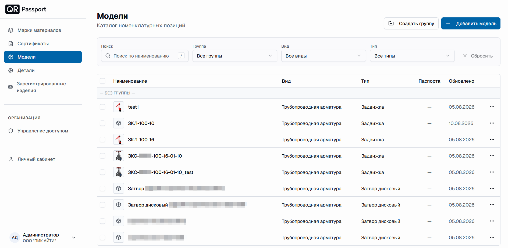
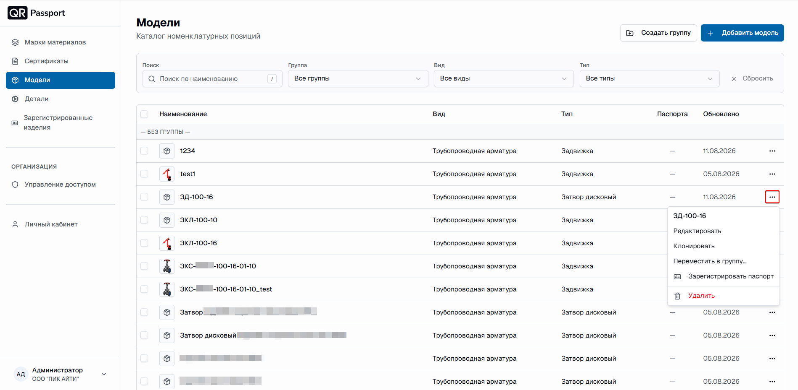

  <a href="/QR-Passport/ru/">Главная</a> / Модели

# Модели

Раздел «Модели» – каталог номенклатурных позиций. Модель объединяет однотипные изделия и хранит их общие характеристики, шаблоны паспортов и документы.

Основной принцип работы – последовательная цепочка:

1. Создайте **модель**.
2. Выберите и заполните **шаблон** паспорта (см. [Описание шаблонов](templates.md)).
3. **Зарегистрируйте изделие** на основе модели.



Удаление выполняется в обратном порядке: сначала зарегистрированные изделия, затем шаблон, затем модель.



## Внешний вид раздела

В верхней части раздела расположены кнопки:

- **Создать группу** – визуальное объединение моделей, например по типу оборудования;
- **Добавить модель** – переход к форме [создания модели](create_model.md).

Ниже – панель фильтров и список моделей.

### Фильтры

- **Поиск** – поиск по наименованию модели;
- **Группа** – показать модели только выбранной группы;
- **Вид** – фильтр по виду изделия;
- **Тип** – фильтр по типу элемента;
- **Сбросить** – сброс поиска и всех фильтров.

### Список моделей

В таблице отображаются:

1. **Наименование** – имя модели и её изображение.
2. **Вид** – вид изделия, например «Трубопроводная арматура».
3. **Тип** – тип элемента, например «Задвижка» или «Затвор дисковый».
4. **Паспорта** – количество зарегистрированных изделий по модели.
5. **Обновлено** – дата последнего изменения модели.
6. Кнопка (**⋯**) – меню действий с моделью:

   

   - **Редактировать** – изменение характеристик модели;
   - **Клонировать** – создание копии модели вместе с шаблонами (см. [Клонирование модели](create_model.html#klonirovanie-modeli));
   - **Переместить в группу...** – перенос модели в другую группу;
   - **Зарегистрировать паспорт** – переход к регистрации изделий по модели;
   - **Удалить** – удаление модели.



Модели, не привязанные к группе, отображаются под заголовком «– БЕЗ ГРУППЫ –».



## Страница модели

Откройте модель из списка – откроется страница модели с двумя вкладками:

- **Обзор** – основные характеристики: вид и тип изделия, параметры DN и PN, тип присоединения и способ управления, материал корпуса, прикреплённые документы;
- **Шаблоны** – шаблоны паспортов, привязанные к модели (см. [Описание шаблонов](templates.md)).

В верхней части страницы расположены кнопки:

- **Зарегистрировать изделие** – запуск регистрации изделий по модели;
- **Редактировать** – изменение характеристик модели;
- (**⋯**) – меню действий, включая удаление модели.

## Группы моделей

Группа – визуальное объединение моделей; на характеристики изделий она не влияет, и её можно изменить позже.

Создание группы:

1. Нажмите кнопку **Создать группу**.
2. Введите название группы – например, `Дисковые затворы`.
3. Нажмите кнопку **Создать**.

Назначение модели в группу выполняется в поле **Группа** при создании или редактировании модели.

Удаление группы:

1. В разделе **Модели** нажмите (**⋯**) напротив группы.
2. Выберите **Удалить**.
3. Нажмите **Удалить группу**.

