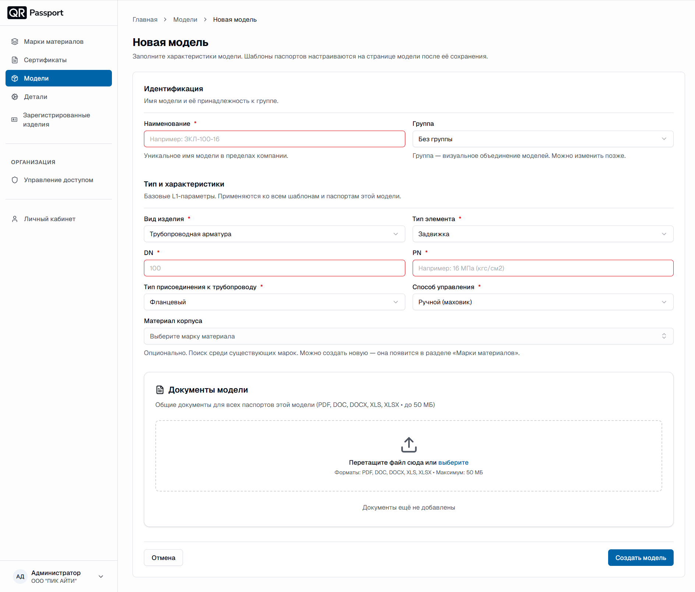
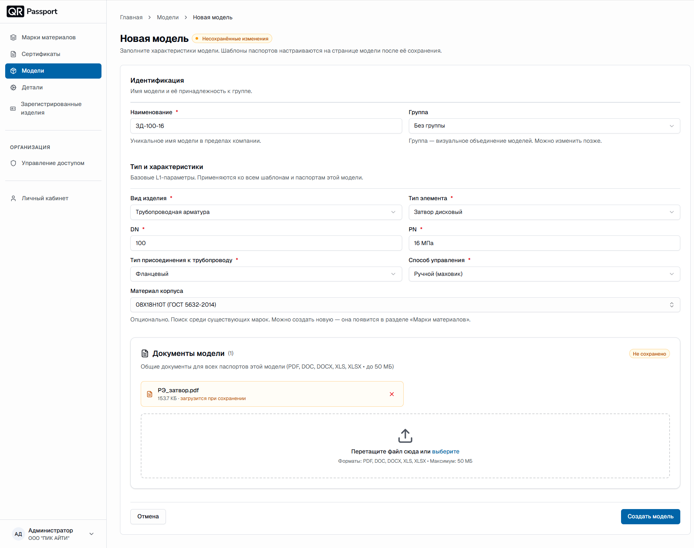
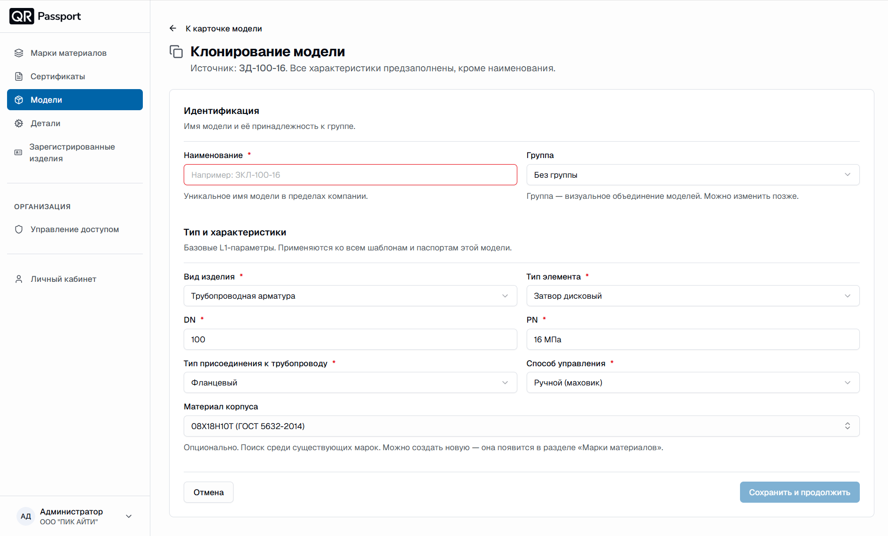
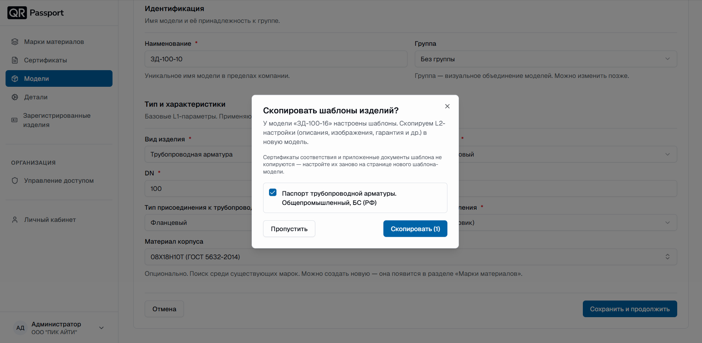

  <a href="/ru/">Главная</a> / Создание модели

# Создание модели

Модель создается первой – до выбора шаблона и регистрации изделий. Заполните характеристики модели; шаблоны паспортов настраиваются на странице модели после ее сохранения.

## Форма создания модели

1. В разделе **Модели** нажмите кнопку **Добавить модель**.
2. Заполните блок **Идентификация**:
   - **Наименование** – уникальное имя модели в пределах компании, например `ЗД-100-16`;
   - **Группа** – визуальное объединение моделей; по умолчанию «Без группы», можно изменить позже.
3. Заполните блок **Тип и характеристики** – базовые L1-параметры, которые применяются ко всем шаблонам и паспортам этой модели:
   - **Вид изделия** – например, `Трубопроводная арматура`;
   - **Тип элемента** – например, `Задвижка` или `Затвор дисковый`;
   - **DN** – номинальный диаметр, например `100`;
   - **PN** – номинальное давление, например `1,6 МПа` или `16 кгс/см²` или `1,6 МПа (16 кгс/см²)`;
   - **Тип присоединения к трубопроводу** – например, `Фланцевый`;
   - **Способ управления** – например, `Ручной (маховик)`;
   - **Материал корпуса** – опционально: выберите существующую марку из списка или создайте новую – она появится в разделе «Марки материалов».
4. При необходимости прикрепите файлы в блоке **Документы модели** – общие документы для всех паспортов этой модели. Форматы: PDF, DOC, DOCX, XLS, XLSX, размер до 50 МБ. Файлы загрузятся после сохранения модели.
5. Нажмите кнопку **Создать модель**. Кнопка **Отмена** возвращает к списку без сохранения.

Во время заполнения рядом с заголовком отображается метка «Несохранённые изменения». Если обязательное поле не заполнено, при попытке сохранения оно подсвечивается красным – заполните подсвеченные поля и повторите сохранение.

## После создания

Открывается страница модели. Дальнейшие шаги:

1. Добавьте и заполните шаблон паспорта – см. [Описание шаблонов](templates.md).
2. Зарегистрируйте изделия – см. раздел [Зарегистрированные изделия](../registered_products/about.md).

## Клонирование модели

Один раз заполните модель и шаблон – а дальше для однотипных моделей используйте клонирование: характеристики и шаблоны скопируются, останется только зарегистрировать изделия.

1. В списке моделей нажмите (**⋯**) напротив нужной модели и выберите **Клонировать**.
2. Откроется форма «Клонирование модели»: все характеристики источника предзаполнены, кроме наименования.

   

3. Введите уникальное **наименование** новой модели; при необходимости измените группу или характеристики.
4. Нажмите **Сохранить и продолжить**.
5. В окне «Скопировать шаблоны изделий?» отметьте галочками шаблоны, которые нужно перенести в новую модель, и нажмите **Скопировать (N)**. Если шаблоны не нужны – нажмите **Пропустить**.

   



При копировании шаблона переносятся его L2-настройки: описания, изображения, гарантия и другие. Сертификаты соответствия и приложенные документы шаблона **не копируются** – их нужно настроить заново на странице нового шаблона-модели.



После клонирования остается зарегистрировать изделия – см. раздел «Зарегистрированные изделия».