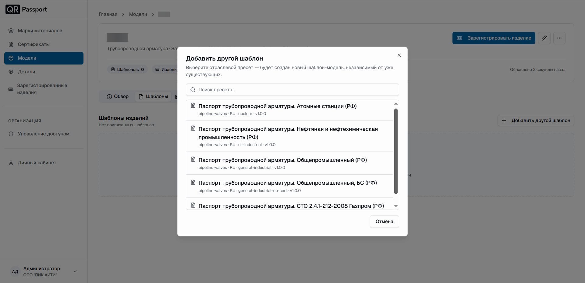

  <a href="/QR-Passport/ru/">Главная</a> / Описание шаблонов

# Описание шаблонов

Шаблон паспорта – готовая структура документа с разделами, подразделами и характеристиками в соответствии с отраслевыми и нормативными документами. К одной модели можно привязать несколько шаблонов – например, для разных отраслей поставки.

## Добавление шаблона

1. Откройте модель и перейдите во вкладку **Шаблоны**.
2. Нажмите кнопку **Добавить другой шаблон**.
3. В появившемся окне выберите отраслевой пресет – будет создан новый шаблон-модель, независимый от уже существующих. Для быстрого поиска используйте поле «Поиск пресета».
4. Выбранный шаблон появится на странице модели – можно переходить к заполнению.

Доступные отраслевые пресеты:

- Паспорт трубопроводной арматуры. Атомные станции (РФ);
- Паспорт трубопроводной арматуры. Нефтяная и нефтехимическая промышленность (РФ);
- Паспорт трубопроводной арматуры. Общепромышленный (РФ);
- Паспорт трубопроводной арматуры. Общепромышленный, БС (РФ);
- Паспорт трубопроводной арматуры. СТО 2.4.1-212-2008 Газпром (РФ).

## Структура шаблона

Шаблон состоит из разделов. Обязательные поля отмечены звёздочкой – без них шаблон не сохранится. Разделы, не нужные для конкретного изделия, отключаются переключателем – например, раздел **Привод** отключают, если способ управления ручной.

Основные разделы шаблона:

- **Титульный лист** – логотип изготовителя, наименование изделия, обозначение паспорта;
- **Основные сведения** – изготовитель и общие данные;
- **Основные технические данные** – технические параметры для изделия;
- **Привод** – характеристики привода (отключается для ручного управления, доступно только для трубопроводной арматуры);
- **Материалы основных деталей** – химический состав и механические свойства по деталям;
- **Контроль и испытания** – вид контроля и данные приёмо-сдаточных испытаний;
- **Комплектность** – состав поставки;
- **Свидетельство о приёмке**.

## Заполнение шаблона

1. Заполните обязательные поля, отмеченные звёздочкой. После заполнения блока нажимайте **Готово**.
2. В табличных разделах (химический состав, механические свойства, испытания, комплектность) добавляйте строки кнопкой **+ строку** справа.
3. Для химического состава и механических свойств выберите в строке созданную **деталь** и **сертификат** – значения подтянутся из них автоматически, вручную переписывать ничего не нужно.
4. Отключите переключателями разделы, которые не применяются к изделию.
5. Убедитесь, что все обязательные поля заполнены, и нажмите **Сохранить**.
6. Подтвердите изменения кнопкой **Подтвердить**.



Если обязательное поле не заполнено, система подсветит его и не сохранит шаблон – вернитесь к подсвеченным полям и заполните их.



## Удаление шаблона

1. Перейдите во вкладку **Шаблоны**.
2. Нажмите (**⋯**) справа от шаблона.
3. Выберите **Удалить шаблон**.
4. Нажмите **Удалить шаблон**.



Перед удалением шаблона удалите зарегистрированные по нему изделия – порядок такой: изделия – шаблон – модель.

