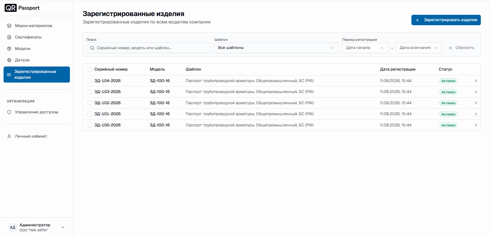
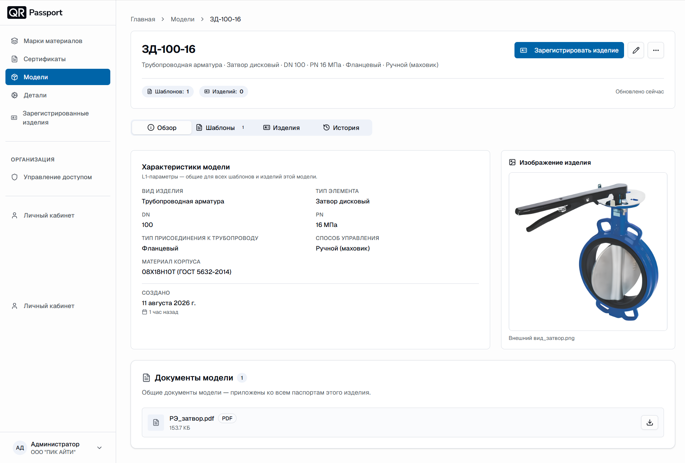
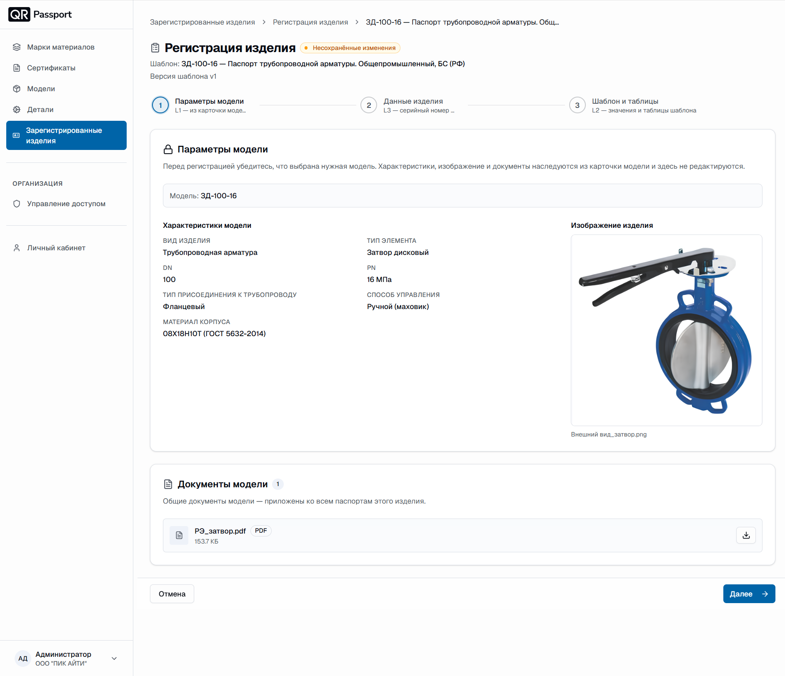
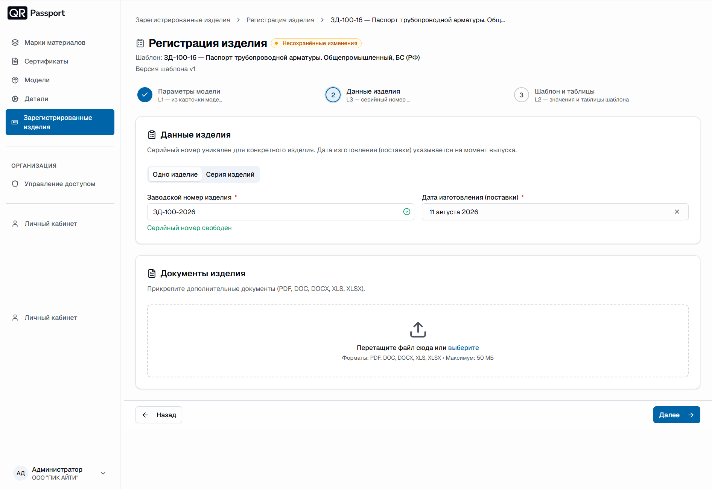
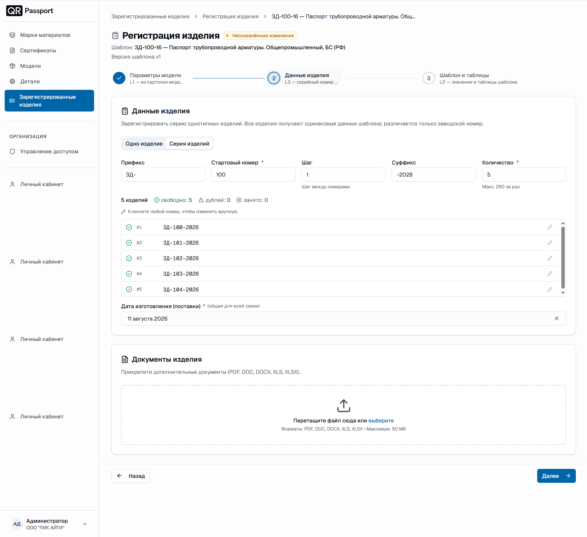
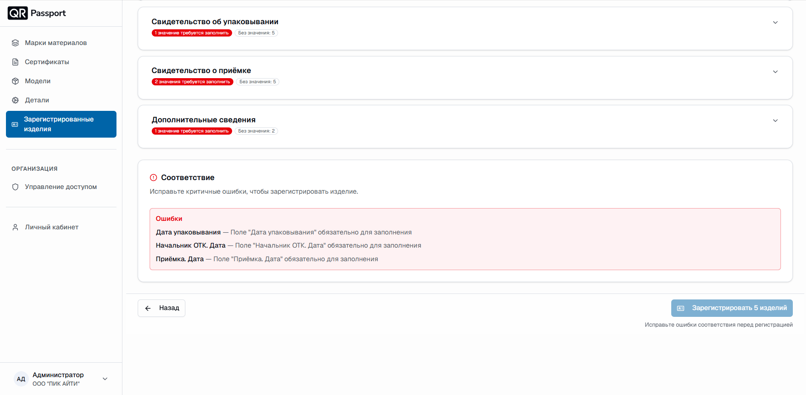
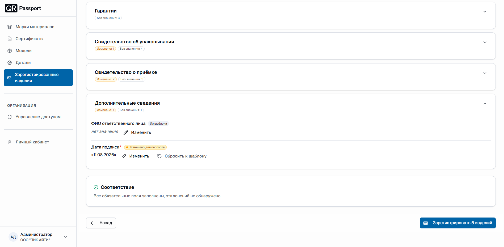
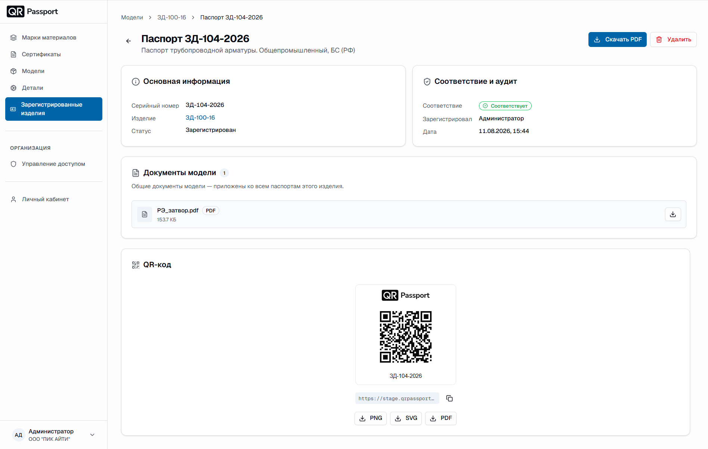
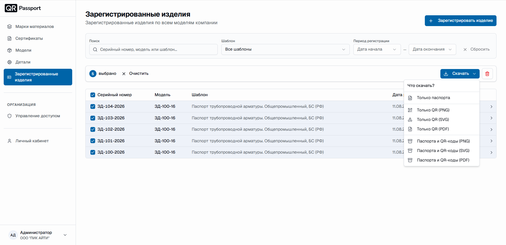
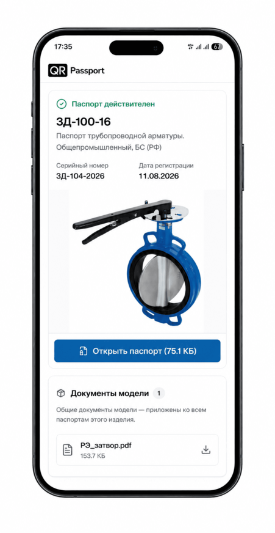

# Зарегистрированные изделия

Раздел «Зарегистрированные изделия» хранит все зарегистрированные изделия по всем моделям компании. Зарегистрированное изделие – полноценный объект учета: оно получает серийный номер, собственный QR-код и паспорт, а документация по нему отслеживается на актуальность.

## Внешний вид раздела

В таблице отображаются:

1. **Серийный номер** – заводской номер изделия.
2. **Модель** – модель, по которой зарегистрировано изделие.
3. **Шаблон** – шаблон паспорта изделия.
4. **Дата регистрации** – дата и время регистрации.
5. **Статус** – текущий статус изделия (например, «Активен»).

Фильтры раздела:

- **Поиск** – по серийному номеру, модели или шаблону;
- **Шаблон** – показать изделия только выбранного шаблона;
- **Период регистрации** – ограничить список датами начала и окончания;
- **Сбросить** – сброс поиска и фильтров.

Нажмите на строку изделия, чтобы открыть его карточку с паспортом и QR-кодом. Кнопка **Зарегистрировать изделие** запускает окно регистрации.

## Регистрация изделия

Регистрация выполняется в три шага: **Параметры модели** (L1), **Данные изделия** (L3) и **Шаблон и таблицы** (L2).

1. Откройте модель в разделе **Модели**.
2. Нажмите кнопку **Зарегистрировать изделие**.

### Шаг 1. Параметры модели

Проверьте, что выбрана нужная модель. Характеристики, изображение и документы наследуются из карточки модели и на этом шаге не редактируются. Нажмите **Далее**.

### Шаг 2. Данные изделия

Выберите режим регистрации – **Одно изделие** или **Серия изделий**.



- **Одно изделие.** Заполните:

  - **Заводской номер изделия** – система сразу проверит номер: подсказка «Серийный номер свободен» означает, что номер можно использовать;
  - **Дата изготовления (поставки)**.

  

- **Серия изделий.** Заполните:

  - **Префикс** – это неизменяемое начало заводского номер, например `ЗД-` (или поле может быть пустым);
  - **Стартовый номер** – это начало изменяемой части заводского номера;
  - **Шаг** – шаг между номерами (по умолчанию 1);
  - **Суффикс** – это неизменяемый конец заводского номера, например `-2026` (или поле может быть пустым);
  - **Количество** – сколько изделий выпустить (максимум 250 за раз).

  

  Система показывает сводку по номерам: заводской номер свободен или занят. 

  
  
Кликните любой номер в списке, чтобы изменить его вручную. 
**Дата изготовления (поставки)** указывается одна для всей серии.



В блоке **Документы изделия** при необходимости прикрепите дополнительные документы изделия (PDF, DOC, DOCX, XLS, XLSX, до 50 МБ). Нажмите **Далее**.

### Шаг 3. Шаблон и таблицы

На этом шаге заполняются значения и таблицы шаблона – L2-данные паспорта.

Разделы шаблона раскрываются по стрелке справа. У каждого раздела видны метки: «требуется заполнить» – сколько обязательных значений не заполнено, «Без значения» – сколько необязательных полей пустые, «Изменено» – сколько значений вы изменили.

- Нажмите **Изменить**, чтобы задать значение для конкретного паспорта.
- Нажмите **Сбросить к шаблону**, чтобы вернуть значение из шаблона.

Блок **Соответствие** проверяет обязательные поля. Пока есть критичные ошибки, они перечислены списком, а кнопка регистрации неактивна с подсказкой «Исправьте ошибки соответствия перед регистрацией».

Заполните перечисленные поля (например, «Дата упаковывания», «Начальник ОТК. Дата», «Приёмка. Дата») – блок «Соответствие» станет зелёным: «Все обязательные поля заполнены, отклонений не обнаружено».

Нажмите **Зарегистрировать N изделий** для серии или **Зарегистрировать изделие** для одного изделия.

## Страница зарегистрированного изделия

Нажмите на строку изделия в списке – откроется страница его паспорта.

На странице отображаются:

- **Основная информация** – серийный номер, модель (ссылка на карточку) и статус изделия;
- **Соответствие и аудит** – результат проверки соответствия, кто зарегистрировал изделие и дата регистрации;
- **Документы модели** – общие документы, приложенные ко всем паспортам этой модели;
- **QR-код** – код изделия со ссылкой на публичную страницу, кнопкой копирования ссылки и скачиванием кода в форматах PNG, SVG или PDF.

В правом верхнем углу – кнопки **Скачать PDF** (паспорт изделия) и **Удалить**.

## Действия с изделиями в списке

Отметьте изделия галочками – появится панель «N выбрано» с кнопкой **Очистить** и действиями над выбранными.

- **Скачать** – меню вариантов загрузки:
  - только паспорта;
  - только QR-коды (PNG, SVG или PDF);
  - паспорта и QR-коды вместе (PNG, SVG или PDF).
- Кнопка с корзиной – удаление выбранных изделий с подтверждением.

## Публичная страница по QR-коду

Отсканируйте QR-код изделия – откроется публичная страница паспорта, доступная без входа в систему. На ней видны статус «Паспорт действителен», модель, серийный номер, дата регистрации, изображение изделия, кнопка «Открыть паспорт» и документы модели. Именно эту страницу видит ваш клиент после сканирования кода на корпусе.

## Результат

Зарегистрированные изделия появляются в списке раздела со статусом «Активен». Из карточки изделия можно скачать паспорт и QR-код, а при необходимости – удалить изделие, отметив его галочкой в списке.

<!--Подраздел **Зарегистрированные изделия** предназначен для отображения списка зарегистрированных изделий в QR-Passport. 

## Описание главного окна

Таблица зарегистрированных изделий содержит следующие колонки:
* _серийный номер_ – уникальный идентификатор изделия (выше по наименованию этой колонки осуществляется поиск изделий);
* _дата регистрации_ – дата и время добавления изделия в систему (справа доступна фильтрация по дате регистрации);
* _модель_ – модель оборудования, к которой относится изделие (справа доступна фильтрация по моделям оборудования).

## Просмотр детальной информации
Для просмотра полной информации об изделии необходимо выбрать соответствующую запись из общего списка.

При нажатии на серийный номер осуществляется переход в карточку изделия, где доступны следующие блоки информации:
* _общая информация по изделию_ – модель и срок дополнительной гарантии;



При необходимости можно добавить для выбранного изделия дополнительную гарантию. Для этого нужно нажать кнопку **Редактировать** и ввести количество месяцев дополнительной гарантии.



* _динамические параметры_ – заполненные динамические параметры этого изделия;
* _документы для изделий_ – индивидуальные документы изделия (при наличии).

## Скачивание QR-кода/QR-кодов
Для скачивания QR-кода выполните следующие шаги:
1. Перейдите к подразделу **Зарегистрированные изделия**
2. С помощью галочек выберите нужное количество изделий
3. В выпадающем списке выберите **Скачать QR-коды**
4. Нажмите кнопку **Выполнить**







Чтобы выбрать несколько изделий подряд, кликните на галочку напротив серийного номера первого изделия, затем зажмите Shift и кликните на последний – все промежуточные элементы выделятся автоматически.



5. В выпадающем списке выберите формат файла: SVG или PDF 
6. Выберите формат этикетки: квадрат или прямоугольник 
7. Выберите размер этикетки или введите свое значение, выбрав галочку «_Свои размеры_»
8. Нажмите кнопку **Скачать QR-код**



{width=400 height=400}



## Скачивание паспорта/паспортов
Для скачивания QR-кода выполните следующие шаги:
1. Перейдите к подразделу **Зарегистрированные изделия**
2. С помощью галочек выберите нужное количество изделий
3. В выпадающем списке выберите **Скачать технические паспорта**
4. Нажмите кнопку **Выполнить**



-->

