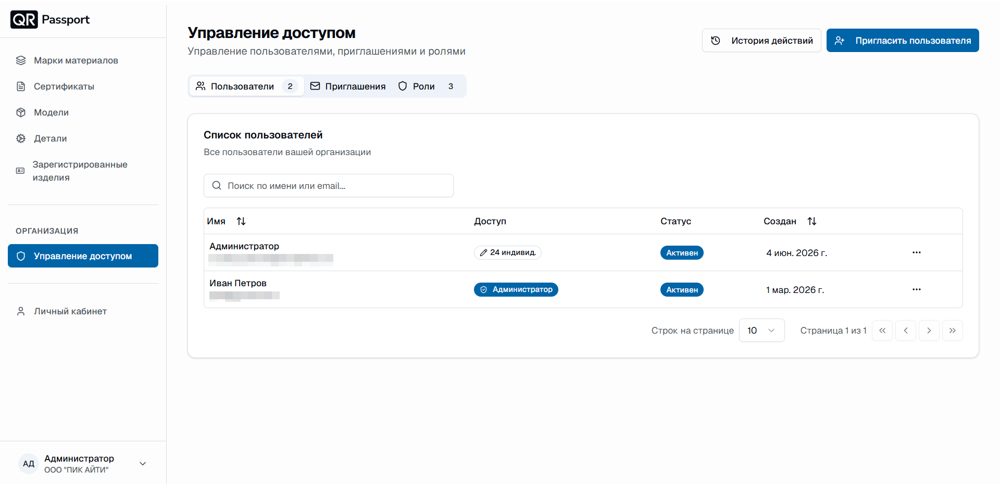
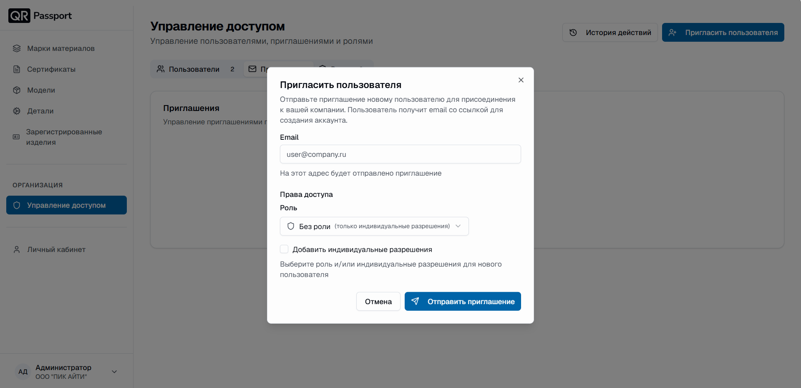
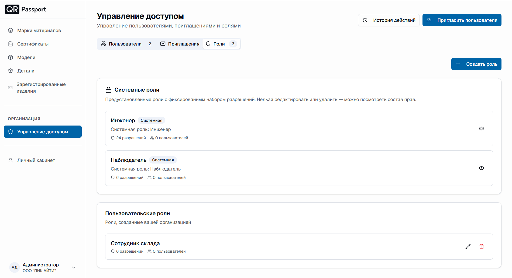
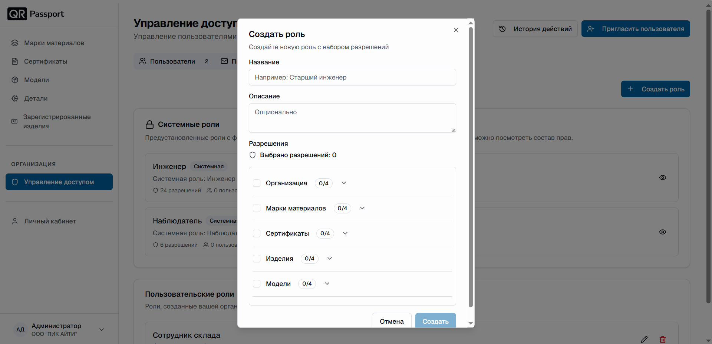
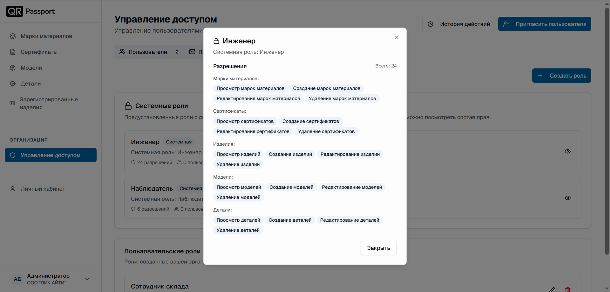
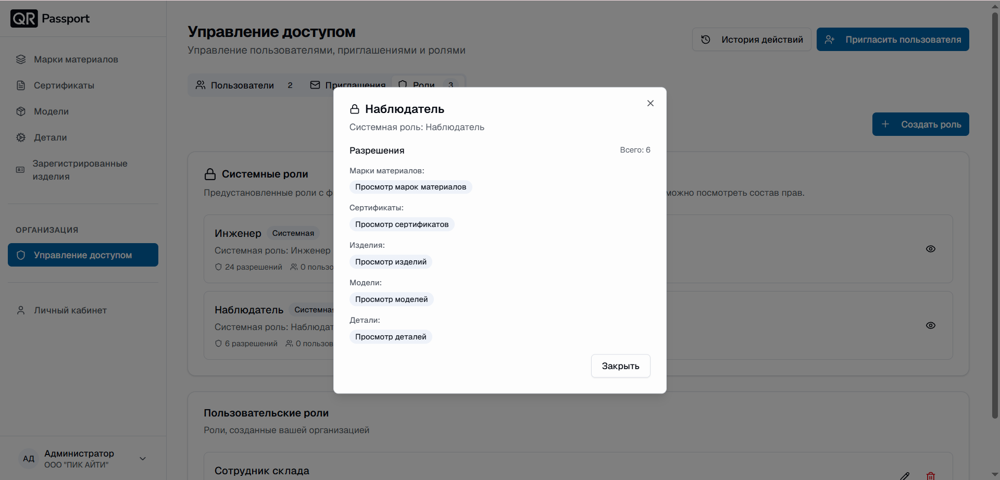
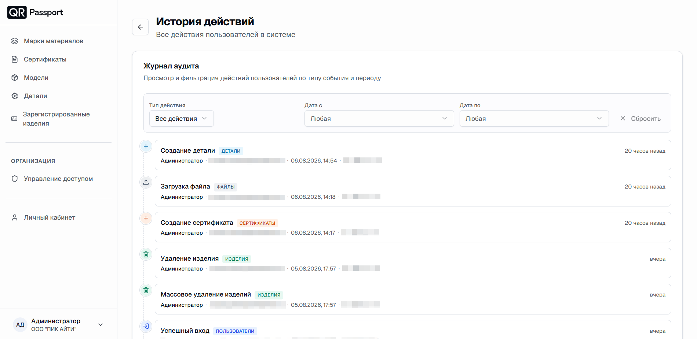

# Управление доступом

Раздел «Управление доступом» позволяет управлять пользователями, приглашениями и ролями вашей организации. В верхней части раздела находятся кнопки:

- **«История действий»** – журнал всех действий пользователей в системе;
- **«Пригласить пользователя»** – отправка приглашения новому сотруднику.

Раздел состоит из трех вкладок: **«Пользователи»**, **«Приглашения»** и **«Роли»** – рядом с названием вкладки указано количество записей.

## Вкладка «Пользователи»

В списке пользователей отображаются:

1. **Имя** – имя пользователя и его email.
2. **Доступ** – роль пользователя или индивидуальные разрешения.
3. **Статус** – активен ли пользователь.
4. **Создан** – дата добавления пользователя в организацию.

Для быстрого поиска используйте поле «Поиск по имени или email». Кнопка (**⋯**) напротив пользователя открывает меню управления его доступом.

## Вкладка «Приглашения»

1. Нажмите кнопку **«Пригласить пользователя»**.
2. В поле **Email** укажите адрес сотрудника – на него будет отправлено письмо со ссылкой для создания аккаунта.
3. В блоке **«Права доступа»** назначьте новому пользователю роль:
   - стандартные роли – **«Инженер»** или **«Наблюдатель»**;
   - роль, созданную вашей организацией.
4. При необходимости отметьте **«Добавить индивидуальные разрешения»**, чтобы точечно настроить права.
5. Нажмите **«Отправить приглашение»**.



Во вкладке «Приглашения» отображаются все отправленные приглашения.



## Вкладка «Роли»

Доступ в системе устроен через роли. Организации всегда доступен администратор, а остальные роли делятся на две группы:

- **Системные роли** – предустановленные роли с фиксированным набором разрешений:
  - **«Инженер»** – полный набор прав для работы с данными;
  - **«Наблюдатель»** – права только на просмотр.



Системные роли нельзя редактировать или удалить – можно только посмотреть состав прав.



- **Пользовательские роли** – роли, созданные вашей организацией (например, «Сотрудник склада»). Их можно редактировать и удалять.

### Создание роли

1. Нажмите кнопку **«Создать роль»**.
2. Укажите **название** (например, «Старший инженер») и при желании **описание**.
3. В блоке **«Разрешения»** отметьте галочками, какие права и к каким разделам получит роль: «Организация», «Марки материалов», «Сертификаты», «Изделия», «Модели» и другие. Раскрыв список раздела, можно выбрать конкретные действия (просмотр, создание, редактирование, удаление).
4. Нажмите **«Создать»**.



После создания роль можно назначать пользователям при приглашении или в карточке пользователя.



### Роли и права

В системе две предустановленные роли, а также роли, созданные вашей организацией. Отдельно стоит администратор – роль с неограниченным доступом.

| Роль | Просмотр | Создание | Редактирование | Регистрация изделий | Удаление |
| --- | --- | --- | --- | --- | --- |
| Администратор | ✓ | ✓ | ✓ | ✓ | ✓ |
| Инженер | ✓ | ✓ | ✓ | ✓ | ✓ |
| Наблюдатель | ✓ | – | – | – | – |

- **Администратор** – неограниченный доступ ко всем функциям системы, включая управление доступом и историю действий. Разрешения администратора не могут быть ограничены.
- **Инженер** – полный цикл работы с данными: марки материалов, сертификаты, детали, модели и изделия (24 разрешения).
- **Наблюдатель** – только просмотр данных во всех разделах (6 разрешений).

Пользовательская роль может сочетать любые разрешения: например, «просмотр и создание» без «редактирования и удаления» – как у роли «Сотрудник склада».



**Инженер** – по четыре разрешения в каждом разделе (просмотр, создание, редактирование, удаление): марки материалов, сертификаты, изделия, модели, детали.

**Наблюдатель** – только просмотр в каждом разделе.



## История действий

Кнопка **«История действий»** открывает журнал аудита – все действия пользователей в системе: создание и удаление данных, загрузка файлов, входы и т. д. Для каждого действия указываются пользователь, дата и тип события.

Журнал можно фильтровать:

- **Тип действия** – показать события только нужного типа;
- **Дата с / Дата по** – ограничить период;
- **«Сбросить»** – очистить фильтры.



Историю действий видит только администратор вашей организации. Команда QR-Passport не имеет доступа к этим данным. А если захочется ограничить доступ внутри компании – это тоже предусмотрено: журнал не отображается у сотрудников, чьим ролям не добавлено соответствующее разрешение.

