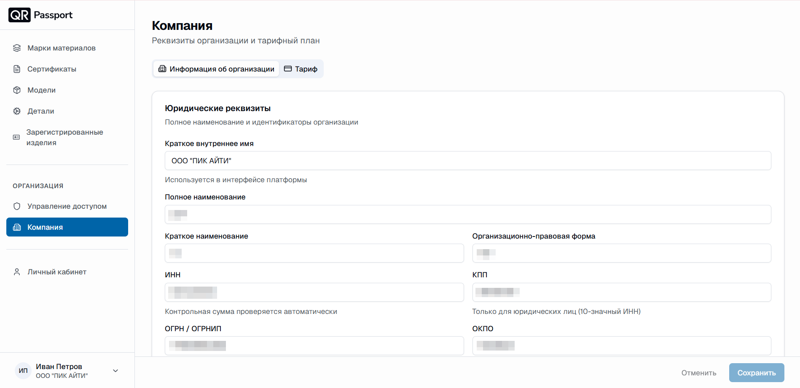
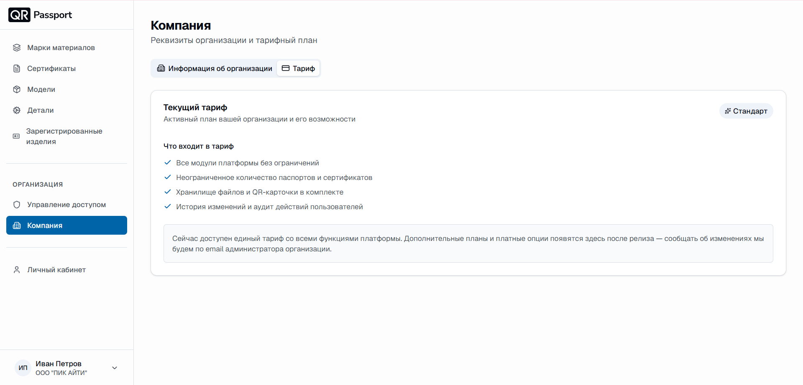

  <a href="/QR-Passport/ru/">Главная</a> / Компания

# Компания

Раздел «Компания» хранит реквизиты организации и информацию о тарифном плане. Реквизиты используются для идентификации организации в системе.

Раздел состоит из двух вкладок: **«Информация об организации»** и **«Тариф»**.

## Вкладка «Информация об организации»

### Юридические реквизиты

Полное наименование и идентификаторы организации:

- **Краткое внутреннее имя** – используется в интерфейсе платформы;
- **Полное наименование**;
- **Краткое наименование**;
- **Организационно-правовая форма**;
- **ИНН** – контрольная сумма проверяется автоматически;
- **КПП** – только для юридических лиц (10-значный ИНН);
- **ОГРН / ОГРНИП**;
- **ОКПО**.

### Адреса и контакты

- **Юридический адрес**;
- **Фактический / почтовый адрес**;
- **Телефон**;
- **Email организации**;
- **Сайт** – можно указать без «https://», префикс добавится автоматически.

### Руководитель

Владелец или ответственное лицо организации:

- **ФИО**;
- **Должность**.

### Банковские реквизиты

Контрольные суммы счетов проверяются по алгоритму ЦБ РФ:

- **Наименование банка**;
- **БИК** – 9 цифр, начинается с 04;
- **Корреспондентский счёт** – 20 цифр, начинается с 301;
- **Расчётный счёт** – 20 цифр.

После заполнения полей нажмите **«Сохранить»**; кнопка **«Отменить»** сбрасывает несохраненные изменения.

## Вкладка «Тариф»

Во вкладке отображается активный план организации и его возможности. Текущий тариф «Стандарт» включает:

- все модули платформы без ограничений;
- неограниченное количество паспортов и сертификатов;
- хранилище файлов и QR-карточки в комплекте;
- историю изменений и аудит действий пользователей.



Сейчас доступен единый тариф со всеми функциями платформы. Дополнительные планы и платные опции появятся после релиза – об изменениях мы сообщим по email администратора организации.

