# Быстрый старт

Раздел содержит пошаговую инструкцию по освоению основного процесса работы в системе QR-Passport – создание моделей оборудования и регистрация изделий.

## Порядок работы
Инструкция разделена на этапы, выполнение которых позволяет последовательно освоить функционал системы. Каждый этап содержит четкие шаги и пояснения. Для начала работы рекомендуется ознакомиться с основными понятиями системы и перейти к тестовой модели.

## Основные понятия и процессы
* **Модель оборудования** –  это модель для группы однотипных изделий. Она содержит общие характеристики, шаблоны, документацию для всех относящихся к нему изделий.

* **Шаблоны изделий** – готовые шаблоны для паспортов, которые содержат основные разделы/подразделы и характеристики в соответствии с отраслевыми и нормативными документами.



На данный момент в QR-Passport заведены пять отраслевых шаблонов для трубопроводной арматуры в соответствии с ГОСТ 34612-2019, ГОСТ Р 2.610-2016, а также с учётом отраслевых требований:
   * _общепромышленный_;
   * _нефтяная отрасль_ – выполнен с учётом требований «Роснефти», «Лукойла», «ИНК»;
   * _газовая отрасль_ – выполнен с учётом требований «Газпрома»;
   * _атомная отрасль_ – выполнен с учётом требований «Росатома».



* **Данные изделия** – настраиваемые характеристики, которые добавляются к модели и заполняются для каждого изделия отдельно. Позволяют учитывать индивидуальные особенности разных единиц оборудования, такие как: заводской номер и дата изготовления.

* **Зарегистрировать изделие** – это процесс внесения в систему данных о конкретной единице продукции, который включает заполнение данных изделия. В результате изделие получает собственный QR-код и становится полноценным объектом учета в системе с возможностью отслеживания актуальности документации, т.е. **_зарегистрированным изделием_**.

## Активные элементы в инструкции
В инструкции используются активные элементы. Ниже приведены примеры таких элементов и пояснения, как с ними работать.



* **_Текст для копирования_** – чтобы не вводить текст вручную, используйте элементы голубого цвета. Например: «_Введите название группы_ `Дисковые затворы`». Кликните на элемент `Дисковые затворы` и текст скопируется в буфер обмена (без визуального подтверждения), после чего вы можете вставить его в нужное поле.

* **_Ссылки для скачивания_** – в разделе есть активные ссылки для скачивания файлов, выглядят они так: «_Прикрепите документ – для тестовой модели используйте этот [документ][1]._». Нажмите на ссылку [документ][1], чтобы скачать файл для тестовой модели.

<!--* **_Дополнительные материалы_** – в конце каждого блока есть ссылки на подробное описание функций. Например: «_Подробнее о структуре оборудования см. [группы](equipment/equipment.md#anchor)_». Используйте эти ссылки, если хотите изучить тему глубже.-->

* **_Скриншоты шагов_** – после каждой группы действий есть раскрывающийся список со скриншотами шагов. Нажмите на «_см. шаги 1,2_», чтобы развернуть изображения.

    

    

    



## Тестовая модель
### Описание

**_Задача: выпустить 5 паспортов на трубопроводную арматуру (дисковый затвор – Затвор ЗД-100) с серийными номерами: ЗД-001-2026 – ЗД-005-2026 от 02.02.2026_**

Для примера зададим этому затвору такие характеристики:
- Группа – _Дисковые затворы_.
- Модель затвора – _Затвор ЗД-100_ с параметрами:
    * _DN = 100;_
    * _PN = 10 МПа;_
    * _Тип присоединения – фланцевый;_
    * _Способ управления – ручной (маховик);_
    * _Материал корпуса – 08Х18Н10Т._    

<!--### Роль в системе
Для данной задачи ваша роль в системе – _company administrator_ с полными правами доступа к системе, кроме доступа к разделу **Техническая поддержка**.-->

## Шаги выполнения
### Структура оборудования
В первую очередь необходимо создать марку материала корпуса – 08Х18Н10Т. Для этого выполните следующие шаги:

1. Перейдите в раздел **Марки материалов**.
2. Нажмите кнопку **Добавить марку**.
3. Введите название марки – `08Х18Н10Т`.
4. Введите название нормативного документа (далее – НД), где описаны параметры этой марки – `ТУ 14-3Р-197-2001`.
5. Затем переписываем химический состав этой марки из НД.
6. Переписываем механические свойства этой марки из НД.
7. Нажмите кнопку **Сохранить**.





Далее приступаем к созданию сертификата. Для этого выполните следующие шаги:

8. Перейдите в раздел **Сертификаты**.
9. Нажмите кнопку **Добавить сертификат**.
10. Введите название сертификата – `12501-03`.
11. Прикрепите документ – для тестовой модели используйте этот [документ][1].
12. Нажмите кнопку **Добавить первую партию**.
13. Введите название партии/плавки – `626331`.
14. Выберите из выпадающего списка ранее созданую марку материала – **08Х18Н10Т**.
15. Заполните химические и механические свойства как в примере (якобы, взятые из сертификата 12501-03).
16. Нажмите кнопку **Сохранить**.





<!--Далее создаем структуру оборудования. Для того, чтобы классифицировать созданное изделие. 
Для этого выполните следующие шаги:

1. Перейдите в раздел **Модели**. 
2. Нажмите кнопку **Создать группу**.
3. Введите название группы `Дисковые затворы` – так назовем группу, т.к. это название оборудования и его можно взять за основу структуры.
4. Нажмите кнопку **Создать**.



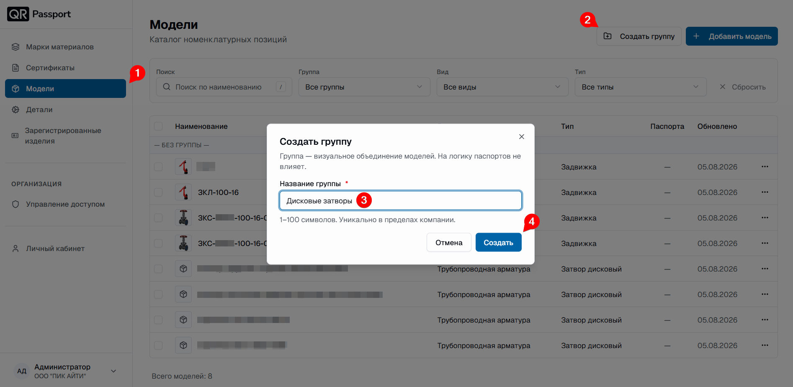

-->

<!--Далее создаем модель в этой группе. Для этого выполните следующие шаги:

5. Нажмите кнопку **Добавить модель**, откроется окно создания модели.
6. Заполните поля этими данными:
   * Наименование – `Затвор ЗД-100`;
   * Группа (выберите в выпадающем списке) – _Дисковые затворы_;
   * Вид изделия (выберите в выпадающем списке) – _Трубопроводная арматура_;
   * Тип элемента (выберите в выпадающем списке) – _Затвор дисковый_;
   * DN – `100`;
   * PN – `10 МПа`;-->

<!--

Для **PN** необходимо указывать единицу измерения: МПа или кгс/см².

-->

<!--

   * Тип присоединения к трубопроводу (выберите в выпадающем списке) – _Фланцевый_;
   * Способ управления (выберите в выпадающем списке) – _Ручной (маховик)_;
   * Материал корпуса (выберите в выпадающем списке) – _08Х18Н10Т_.
7. Загрузите файл. Для тестовой модели используйте этот [документ][1];
8. Нажмите кнопку **Создать модель**.



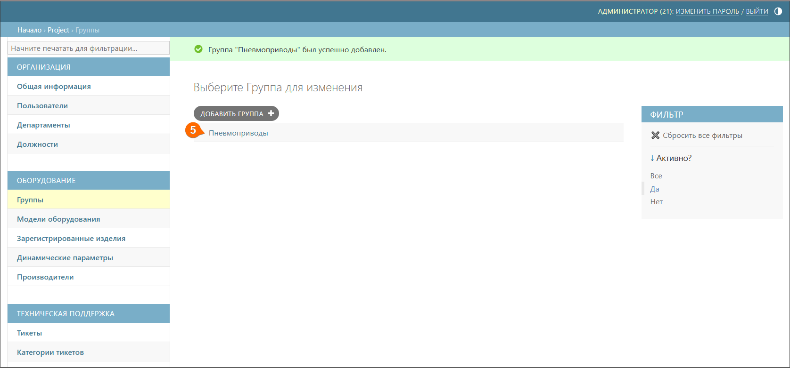

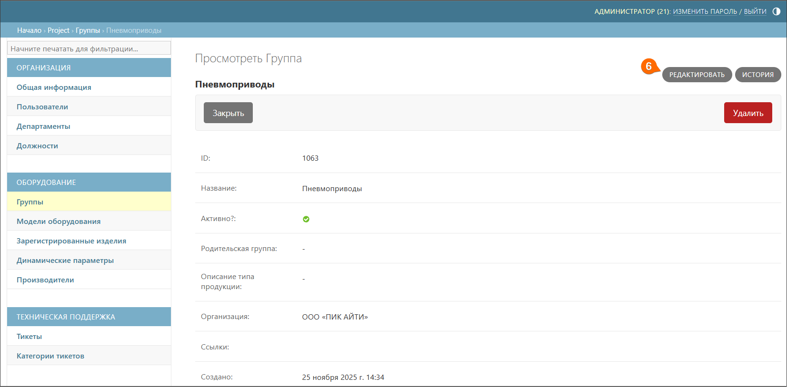

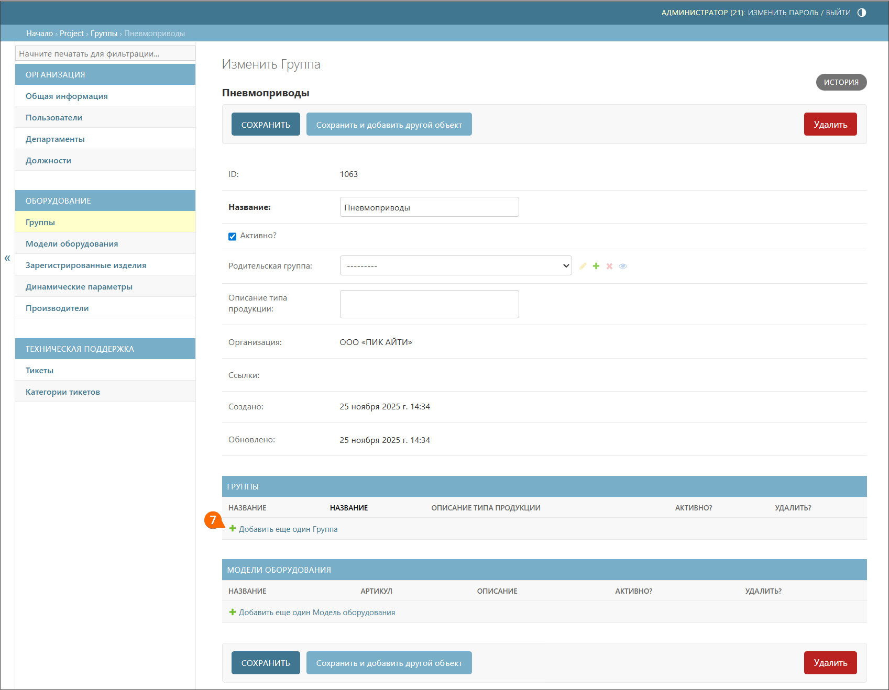





Подробнее о структуре оборудования см. [группы](equipment/equipment.md#anchor).



### Производители
Перед созданием модели необходимо добавить компанию-изготовителя этих пневмоприводов – VTORK Technology (Wuxi) Co., LTD. Для этого выполните следующие шаги:

10. Перейдите в подраздел **Производители**.
11. Нажмите кнопку **Добавить производителя**.
12. Введите наименование `VTORK Technology (Wuxi) Co., LTD`.
13. Нажмите кнопку **Сохранить**.



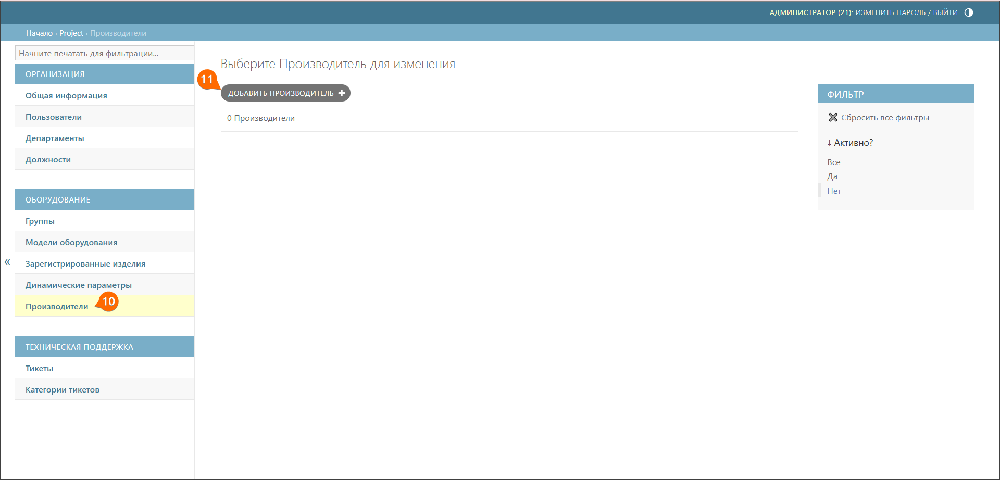

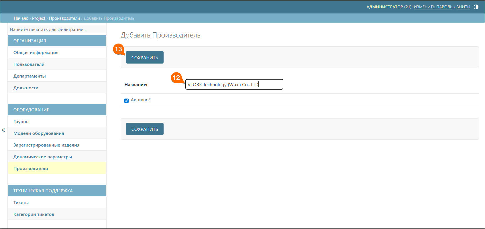





Подробнее о производителях см. [производители](equipment/manufacturers.md#anchor).



### Динамические параметры
Перед созданием модели необходимо добавить динамические параметры этих пневмоприводов – серийный номер, дата изготовления. Для этого выполните следующие шаги:

14. Перейдите в подраздел **Динамические параметры**.
15. Нажмите кнопку **Добавить динамический параметр**.
16. Введите наименование `Серийный номер`.
17. Нажмите кнопку **Сохранить** (для создания динамического параметра `Дата изготовления`, повторите шаги 14-17).



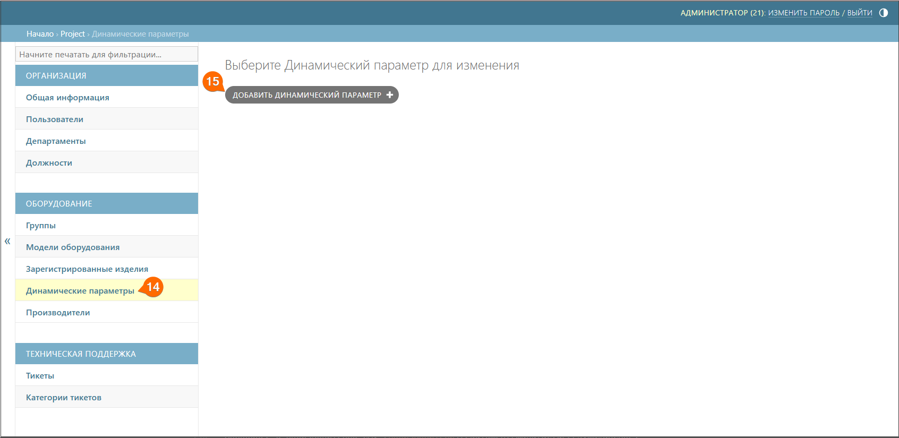

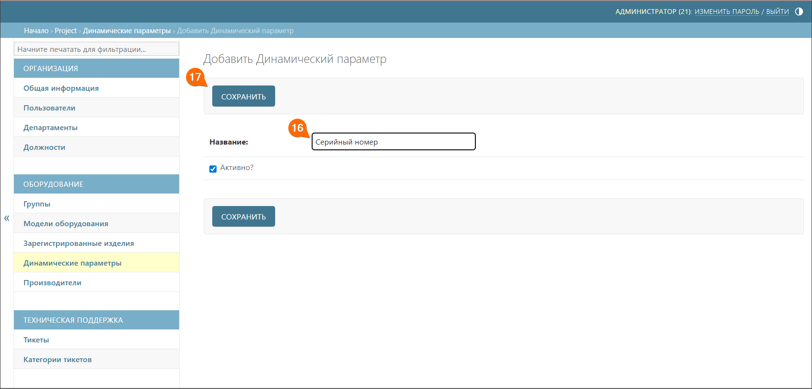





Подробнее о динамических параметрах см. [динамические параметры](equipment/dynamic_parameters.md#anchor).



### Модель оборудования
После создания структуры для модели приступаем к созданию самой модели. Для этого выполните следующие шаги:

18. Перейдите в подраздел **Группы**.
19. Раскройте список, нажав значок «**→**» рядом с наименованием _Пневмоприводы_, и перейдите в подгруппу **Серия VT**. В этой подгруппе будет создана модель.
20. Нажмите кнопку **Редактировать**.
21. Нажмите кнопку **Добавить еще одну модель оборудования**, откроется окно создания модели.
22. Заполните поля этими данными:
    * _название_ – `VT065 S07 F05/07 14 P5021 LLT НЗ`;
    * _изображение_ – загрузите файл. Для тестовой модели используйте этот [файл][2];
    * _описание_ – добавьте описание `Привод пневматический четвертьоборотный, одностороннего действия. Присоединительный фланец F05/07 по ISO 5211, квадрат штока 14 мм. Климатическое исполнение УХЛ1 (-60°С...+80°С). Рабочий диапазон давления управляющего воздуха 3-8 бар.`;
    * _производитель_ – нажмите кнопку **Выбрать**, чтобы выбрать созданного производителя;
    * _группа_ – должна быть уже выбрана, так как мы перешли к созданию модели через подраздел **Группы**;
    * _основная гарантия_ – вводим количество месяцев основной гарантии – `36`;
    * _технический паспорт_ – загрузите файл. Для тестовой модели используйте этот [документ][3];
    * _инструкция по эксплуатации_ – загрузите файл. Для тестовой модели используйте этот [документ][4];
    * _динамические параметры_ – выберите созданные динамические параметры двойным щелчком мыши;
    * _документы_ – загрузите файл, нажав кнопку **Добавить еще один документ**. Для тестовой модели используйте этот [документ][5] и введите название документа – `Сертификат`.
23. Нажмите кнопку **Сохранить**.



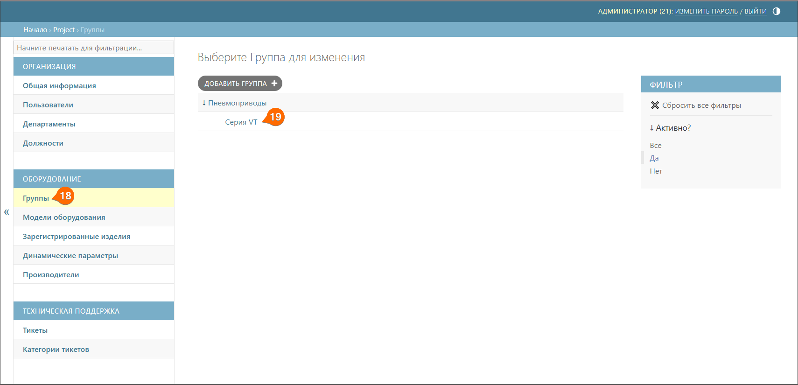

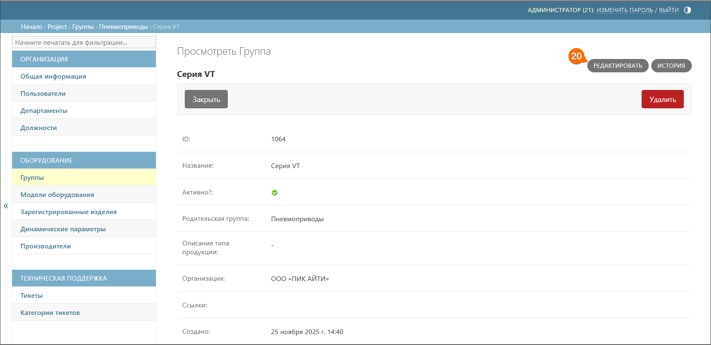

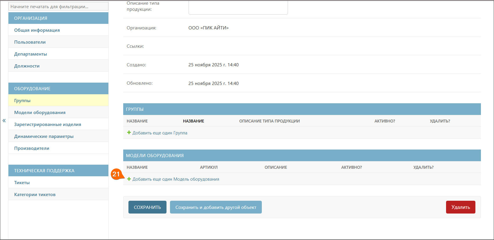

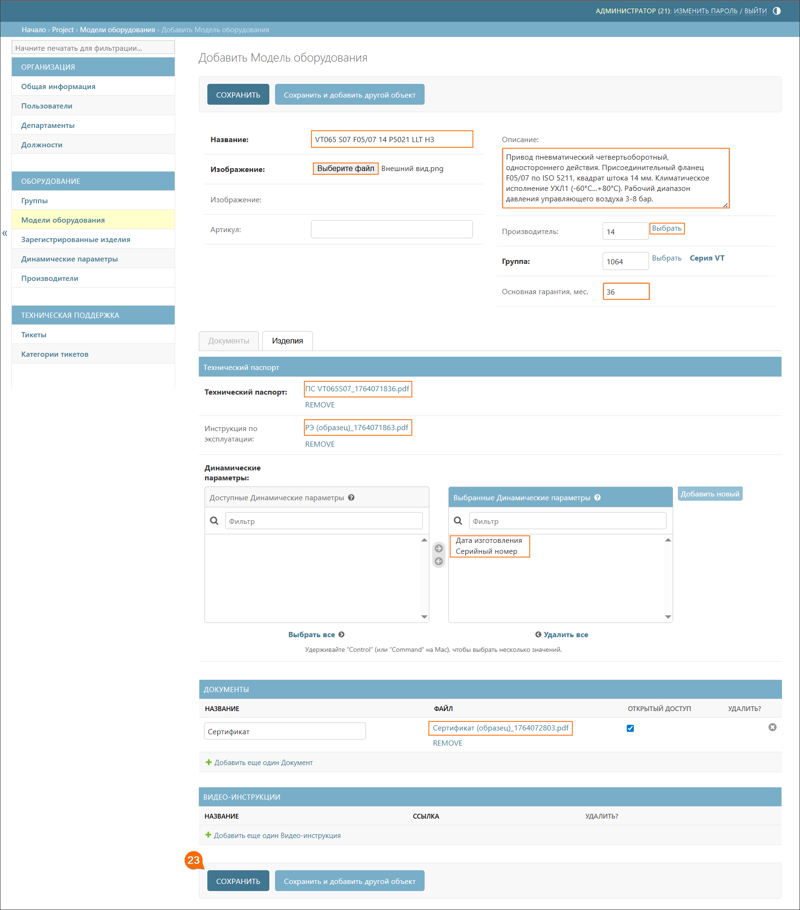





Подробнее о создании моделей см. [модели оборудования](equipment/models.md#anchor).





 После создания модели оборудования возможность регистрации изделий временно недоступна (кнопка **Зарегистрировать изделие** – неактивна), так как администратору системы QR-Passport требуется связать динамические параметры с шаблоном паспорта. Обычно это занимает не более часа.



### Регистрация изделий
После создания модели, переходим к регистрации изделия в системе QR-Passport. Для этого выполните следующие шаги:

24. Перейдите в подраздел **Модели оборудования**.
25. Нажмите на наименование модели **VT065 S07 F05/07 14 P5021 LLT НЗ**.
26. Перейдите к вкладке **Изделия**.
27. Нажмите кнопку **Массовая регистрация**.
28. Заполните поля этими данными:
    * _серийный номер_ – `21112025-00{1}`;
    * _дата изготовления_ – `11/2025`;
    * _инкремент_ – `1`;
    * _количество изделий_ – `5`.
29. Нажмите кнопку **Сохранить**.



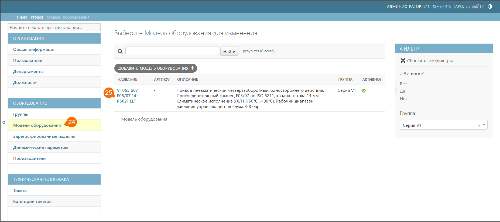

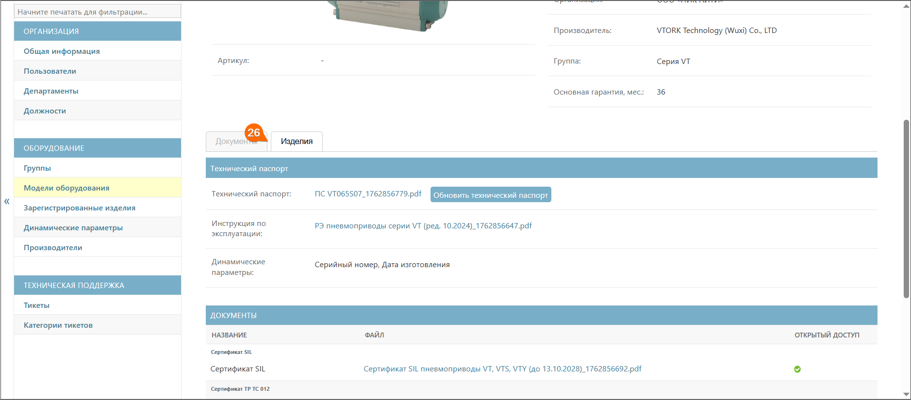

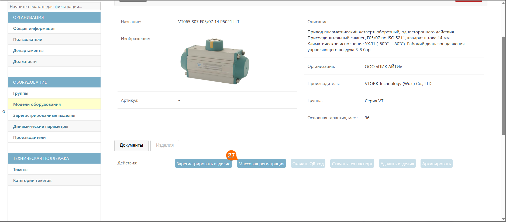

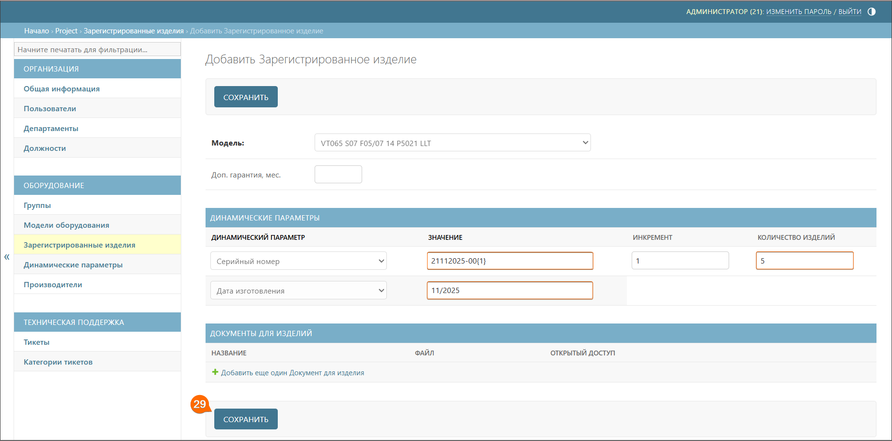





Подробнее о регистрации изделий см. [регистрация изделий](equipment/models.md#registraciya-izdeliya).



### Скачивание QR-кодов

30. Перейдите в подраздел **Зарегистрированные изделия**.
31. Галочками выберите серийные номера изделий (**21112025-001** – **21112025-005**).
32. В выпадающем списке выберите **Скачать QR-коды**.
33. Нажмите кнопку **Выполнить**.
34. Выберите формат этикетки – **Квадрат**.
35. Выберите размер этикетки – **30×30**.
36. Нажмите кнопку **Скачать QR-код**.



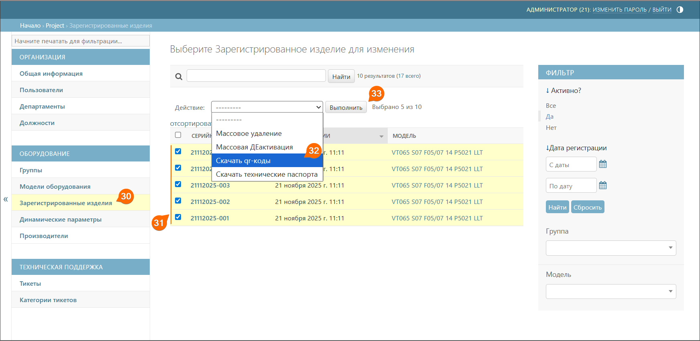

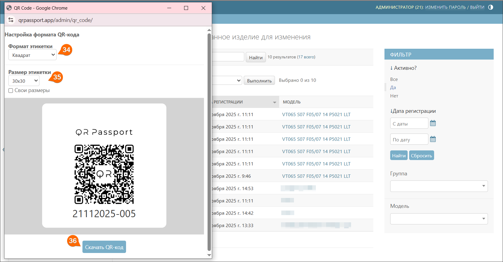





Подробнее о скачивании QR-кодов см. [скачивание QR-кода/QR-кодов](equipment/registered_products.md#skachivanie-qr-koda/qr-kodov).





QR-коды тестовых моделей не предназначены для сканирования – используйте их только для ознакомления с функционалом системы. При сканировании тестового QR-кода система автоматически присваивает изделию статус действующего. После этого модель нельзя будет удалить. 



### Скачивание паспортов

37. Перейдите в подраздел **Зарегистрированные изделия**.
38. Галочками выберите серийные номера изделий (**21112025-001** – **21112025-005**).
39. В выпадающем списке выберите **Скачать технические паспорта**.
40. Нажмите кнопку **Выполнить**.



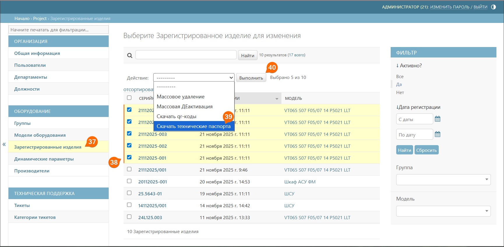





Подробнее о скачивании QR-кодов см. [скачивание паспорта/паспортов](equipment/registered_products.md#skachivanie-pasporta/pasportov).



## Результат

Основные возможности системы QR-Passport изучены. Для перехода к реальной эксплуатации системы необходимо выполнить следующие действия:

1. _Удаление тестовой модели_
   - Перейдите в подраздел **Модели оборудования**.
   - Выберите созданную модель **VT065 S07 F05/07 14 P5021 LLT НЗ**.
   - Нажмите кнопку **Удалить**.
   - Подтвердите удаление, нажав кнопку **Да, я уверен**.



После удаления модели все привязанные к ней изделия удаляются автоматически, а их QR-коды становятся неактивными.



2. _Дальнейшие действия_
    - Изучите остальные разделы инструкции.
    - Приступите к созданию рабочих моделей и регистрации оборудования для повседневной эксплуатации. -->

[1]: https://drive.google.com/file/d/1k1JICkHH7NllwAIMN5Knjx--m0q1d6O_/view?usp=drive_link <!--Сертификат-->
[2]: https://drive.google.com/file/d/11JsryoYYE20jrbBBgLel5rSd8w_YOPDx/view?usp=drive_link <!--Внешний вид-->
[3]: https://drive.google.com/file/d/1BB-MYdtWLJB3HJBXKpRWWGC8fPpekw5f/view?usp=drive_link <!--РЭ-->

