

  <a href="/QR-Passport/ru/">Главная</a> / Практическое руководство

# Практическое руководство

Раздел содержит пошаговую инструкцию по освоению основного процесса работы в системе QR-Passport – создания моделей оборудования и регистрации изделий.

## Порядок работы
Инструкция разделена на этапы, выполнение которых позволяет последовательно освоить функционал системы. Каждый этап содержит чёткие шаги и пояснения. Для начала работы рекомендуется ознакомиться с основными понятиями системы и перейти к тестовой модели.

Этапы выстроены в порядке наследования данных: сначала создается марка материала (источник химического и механического состава), затем сертификат с фактическими значениями для партии, деталь привязывается к марке и технологии, и только после этого собирается модель и регистрируются изделия.

Основные термины QR-Passport собраны в разделе [Основные понятия](concepts.md).

## Активные элементы в инструкции
В инструкции используются активные элементы. Ниже приведены примеры таких элементов и пояснения, как с ними работать.



* **_Текст для копирования_** – чтобы не вводить текст вручную, используйте элементы голубого цвета. Например: «_Введите название группы_ `Дисковые затворы`». Кликните на элемент `Дисковые затворы` и текст скопируется в буфер обмена, после чего вы можете вставить его в нужное поле.

* **_Ссылки для скачивания_** – в разделе есть активные ссылки для скачивания файлов, выглядят они так: «_Прикрепите документ – для тестовой модели используйте этот [сертификат](./_files/quick_start/certificate.pdf)_». Нажмите на ссылку, чтобы скачать файл для тестовой модели.

<!--* **_Дополнительные материалы_** – в конце каждого блока есть ссылки на подробное описание функций. Например: «_Подробнее о структуре оборудования см. [группы](equipment/equipment.md#anchor)_». Используйте эти ссылки, если хотите изучить тему глубже.-->

* **_Скриншоты шагов_** – после каждой группы действий есть раскрывающийся список со скриншотами шагов. Нажмите на «_см. шаги 1,2_», чтобы развернуть изображения.

    

    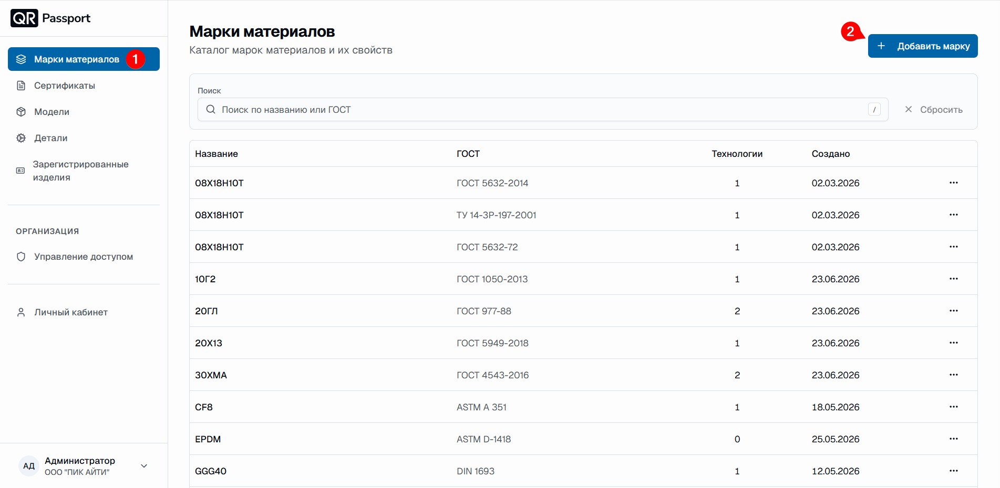

    



## Тестовая модель
### Описание

**_Задача:_** _выпустить 5 паспортов на трубопроводную арматуру (дисковый затвор – Затвор ЗД-100) с серийными номерами: ЗД-001-2026 – ЗД-005-2026 от 02.02.2026._

Для примера зададим этому затвору такие характеристики:
- Группа – _Дисковые затворы_.
- Модель затвора – _Затвор ЗД-100_ с параметрами:
    * DN – _100;_
    * PN – _10 МПа;_
    * Тип присоединения – _фланцевый;_
    * Способ управления – _ручной (маховик);_
    * Материал корпуса – _08Х18Н10Т._    



Пример выполняется на тестовых данных. Созданные в ходе руководства модель, изделия и шаблон в конце инструкции рекомендуется удалить.



## Шаги выполнения
### Марка материалов
Марка материала – источник химического состава и механических свойств: детали и сертификаты будут наследовать эти данные. В первую очередь необходимо создать марку материала корпуса – 08Х18Н10Т. Для этого выполните следующие шаги:

1. Перейдите в раздел **Марки материалов**.
2. Нажмите кнопку **Добавить марку**.
3. Введите название марки – `08Х18Н10Т`.
4. Введите название нормативного документа (далее – НД), где описаны параметры этой марки – `ТУ 14-3Р-197-2001`.
5. Затем переписываем химический состав этой марки из НД (таблица ниже).
6. Переписываем механические свойства этой марки из НД (таблица ниже) и технологию изготовления `Закалка 1100°С-1170°С (ВЗ,М)`.



- Химический состав

| Элемент | Содержание, % |
| --- | :---: |
| Железо (Fe) | основа |
| Кремний (Si) | ≤ 0,8 |
| Марганец (Mn) | ≤ 1,5 |
| Никель (Ni) | 10–11 |
| Сера (S) | ≤ 0,02 |
| Титан (Ti) | ≤ 0,6 |
| Углерод (C) | ≤ 0,08 |
| Фосфор (P) | ≤ 0,035 |

- Механические свойства

| Свойство | Значение |
| --- | :---: |
| Относительное сужение, % | ≥ 55 |
| Относительное удлинение, % | ≥ 35 |
| Предел прочности, МПа | ≥ 510 |
| Предел текучести, МПа | ≥ 216 |



7. Нажмите кнопку **Сохранить**.



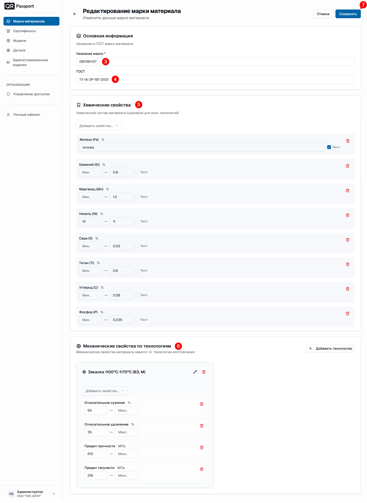



**Результат:** марка материала _08Х18Н10Т_ создана и доступна для выбора при создании сертификата и детали.

### Сертификаты
Сертификат хранит фактические (измеренные) значения свойств для конкретной партии/плавки материала. Далее приступаем к добавлению сертификата. Для этого выполните следующие шаги:

8. Перейдите в раздел **Сертификаты**.
9. Нажмите кнопку **Добавить сертификат**.
10. Введите название сертификата – `12501-03`.
11. Прикрепите документ – для тестовой модели используйте этот [сертификат](./_files/quick_start/certificate.pdf).
12. Нажмите кнопку **Добавить первую партию**.
13. Введите название партии/плавки – `626331`.
14. Выберите из выпадающего списка ранее созданную марку материала – **08Х18Н10Т**.
15. Заполните химические и механические свойства из сертификата 12501-03 (таблица ниже).



- Химический состав

| Элемент | Содержание, % |
| --- | :---: |
| Железо (Fe) | основа |
| Кремний (Si) | 0,7 |
| Марганец (Mn) | 0,5 |
| Никель (Ni) | 10 |
| Сера (S) | 0,01 |
| Титан (Ti) | 0,5 |
| Углерод (C) | 0,07 |
| Фосфор (P) | 0,03 |
| Хром (Cr) | 18 |

- Механические свойства

| Свойство | Значение |
| --- | :---: |
| Относительное сужение, % | 60 |
| Относительное удлинение, % | 40 |
| Предел прочности, МПа | 550 |
| Предел текучести, МПа | 300 |



16. Нажмите кнопку **Сохранить**.



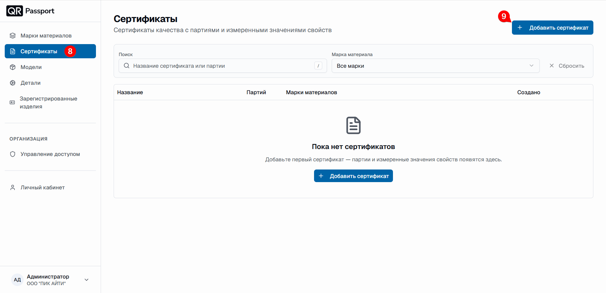

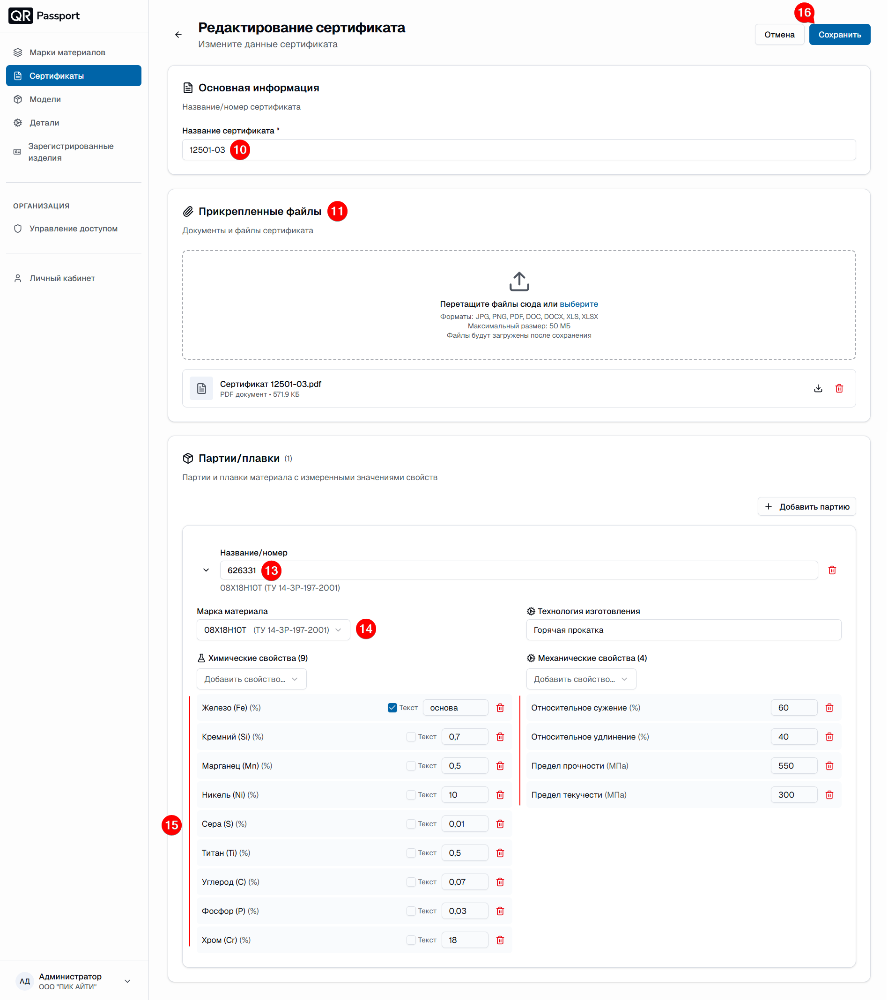



**Результат:** сертификат _12501-03_ создан и содержит фактические значения характеристик партии _626331_.

### Детали
Деталь связывает модель с маркой материала и технологией изготовления – через неё изделие получает свойства. Далее приступаем к добавлению детали. Для этого выполните следующие шаги:

17. Перейдите в раздел **Детали**.
18. Нажмите кнопку **Создать деталь**.
19. Введите название детали – `Корпус затвора ЗД-100`.
20. Введите обозначение детали – `РМТМ.123456.001`.
21. Выберите из выпадающего списка ранее созданную марку материала – **08Х18Н10Т**.
22. Выберите из выпадающего списка ранее созданную технологию изготовления – **Закалка 1100°С-1170°С (ВЗ, М)**.
23. Нажмите кнопку **Создать**.



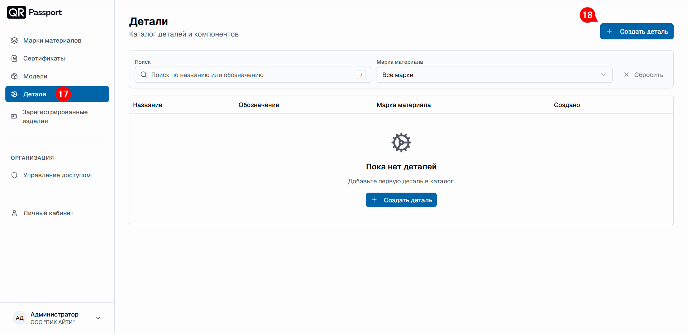

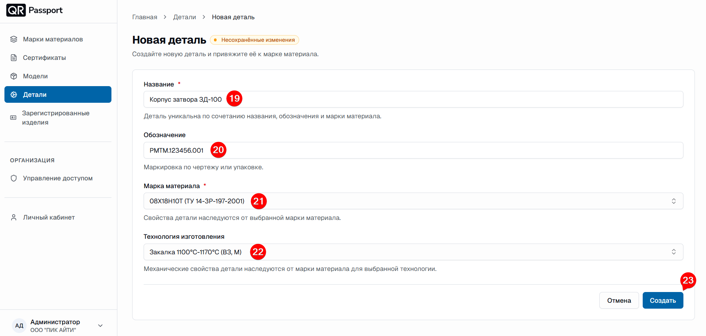



**Результат:** деталь _Корпус затвора ЗД-100_ создана и связывает будущую модель с маркой материала и технологией изготовления.

### Модели
Далее создадим структуру оборудования – группу и модель внутри неё, чтобы классифицировать изделие. Для этого выполните следующие шаги:

24. Перейдите в раздел **Модели**. 
25. Нажмите кнопку **Создать группу**.
26. Введите название группы `Дисковые затворы` – это название типа оборудования, и его удобно взять за основу структуры.
27. Нажмите кнопку **Создать**.



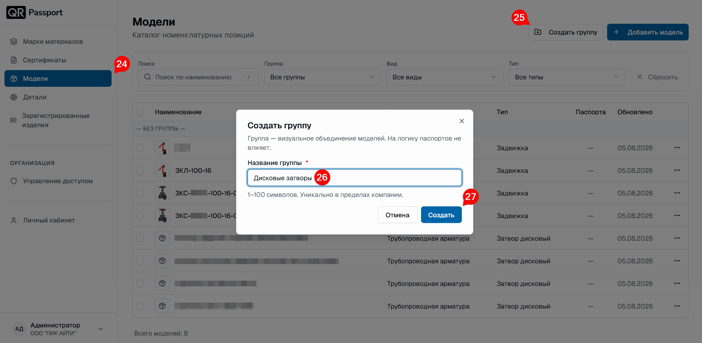



Далее создаем модель внутри группы. Для этого выполните следующие шаги:

28. Нажмите кнопку **Добавить модель**.
29. Введите название модели – `Затвор ЗД-100`.
30. Выберите из выпадающего списка ранее созданную группу – **Дисковые затворы**.
31. Выберите из выпадающего списка вид изделия – **Трубопроводная арматура**.
32. Выберите из выпадающего списка тип элемента – **Затвор дисковый**.
33. Введите параметр DN – `100`.
34. Введите параметр PN – `10 МПа`.
35. Выберите из выпадающего списка тип присоединения – **Фланцевый**.
36. Выберите из выпадающего списка способ управления – **Ручной (маховик)**.
37. Выберите из выпадающего списка ранее созданную марку материала – **08Х18Н10Т**.
38. Прикрепите документ – для тестовой модели используйте пример этого [руководства](./_files/quick_start/manual.pdf).
39. Нажмите кнопку **Создать модель**.
 


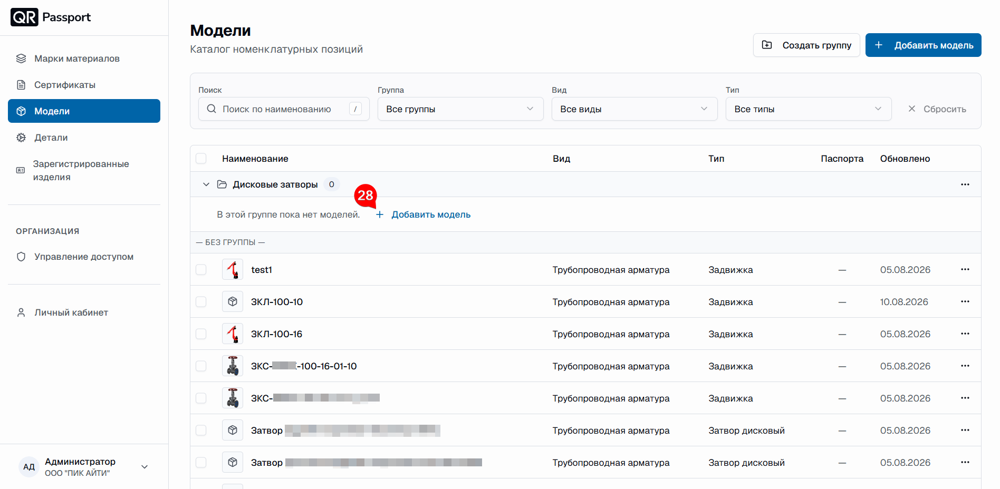

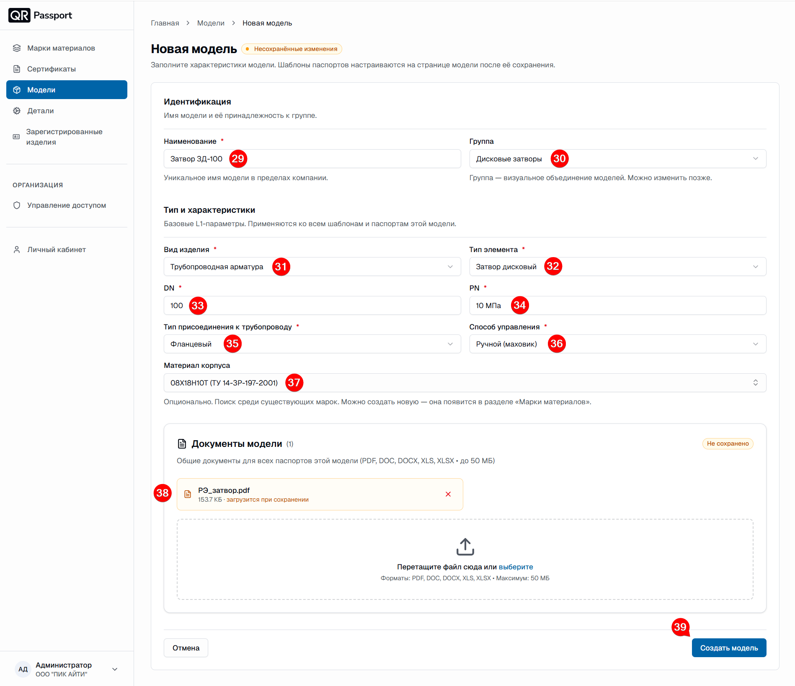



40. Загрузите изображение модели – для тестовой модели используйте это [изображение](./_files/quick_start/model.png).

Далее необходимо выбрать нужный шаблон паспорта для нашей модели. Для примера возьмем «Паспорт трубопроводной арматуры. Общепромышленный, (РФ)». Для этого выполните следующие шаги:

41. Перейдите во вкладку **Шаблоны**.
42. Нажмите кнопку **Добавить другой шаблон**.
43. В появившемся окне выберите из списка шаблон – **Паспорт трубопроводной арматуры. Общепромышленный, (РФ)**.
44. Заполните обязательные поля, отмеченные звёздочкой:
    - Титульный лист: прикрепите логотип – для тестовой модели используйте этот [логотип](./_files/quick_start/logo.png).
    - Титульный лист: введите наименование изделия – `Затвор ЗД-100` → нажмите ниже **Готово**;
    - Титульный лист: введите обозначение паспорта – `РМТМ.123456.001 ПС` → нажмите ниже **Готово**.
    - Основные сведения: введите изготовителя – `ООО «ПИК АЙТИ», Свердловская область, г. Екатеринбург` → нажмите ниже **Готово**.
    - Отключите раздел **Привод** переключателем, т.к. управление затвором – ручное.
    - Материалы основных деталей – химический состав основных деталей:
        * нажмите **+ строку** справа; 
        * выберите созданную деталь **Корпус затвора ЗД…**;
        * выберите ранее созданный сертификат **12501-03**.
    - Материалы основных деталей – механические свойства основных деталей:
        * нажмите **+ строку** справа; 
        * выберите созданную деталь **Корпус затвора ЗД…**;
        * выберите ранее созданный сертификат **12501-03**.
    - Контроль и испытания (вид контроля): введите `Визуальный` → отметка ОТК: введите `Полное соответствие КД`.
    - Контроль и испытания (данные приёмо-сдаточных испытаний):
        * нажмите **+ строку** справа; 
        * введите наименование `Затвор ЗД-100` → введите вид испытаний `Герметичность затвора`.
    - Комплектность (комплект поставки): 
        * введите наименование `Затвор ЗД-100` → обозначение: введите `РМТМ.123456.001` → количество: 1;
        * введите наименование `Паспорт` → обозначение: введите `РМТМ.123456.001 ПС` → количество: 1;
        * введите наименование `Руководство по эксплуатации` → обозначение: введите `РМТМ.123456.001 РЭ` → количество: 1.
    - Отключите раздел **Разрешенные отклонения** переключателем.
    - Отключите раздел **Дополнительные сведения** переключателем.
45. Убедитесь, что все обязательные поля заполнены и нажмите кнопку **Сохранить**.
46. Подтвердите изменения, нажмите кнопку **Подтвердить**.



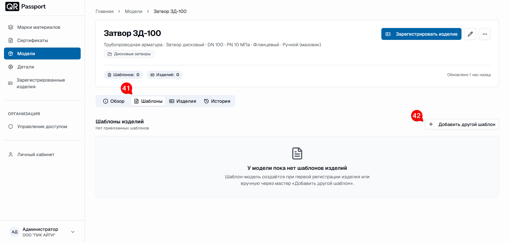

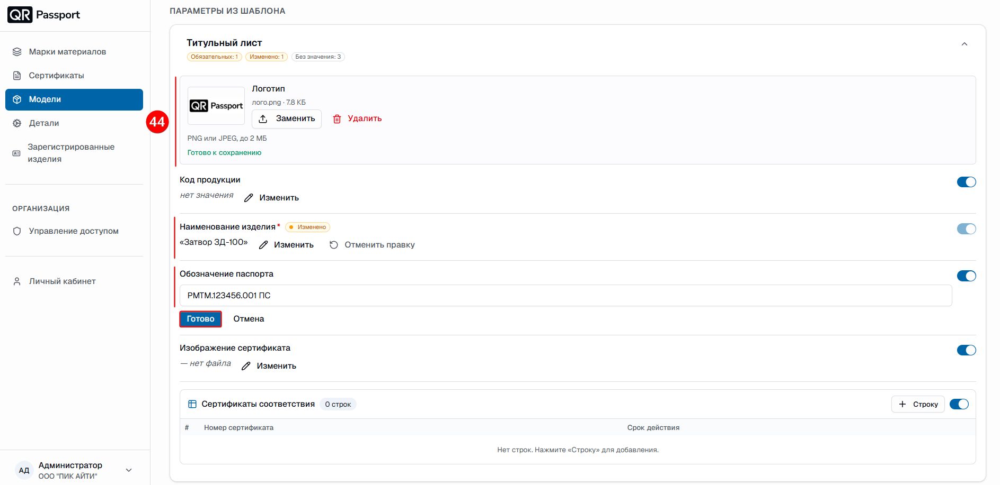

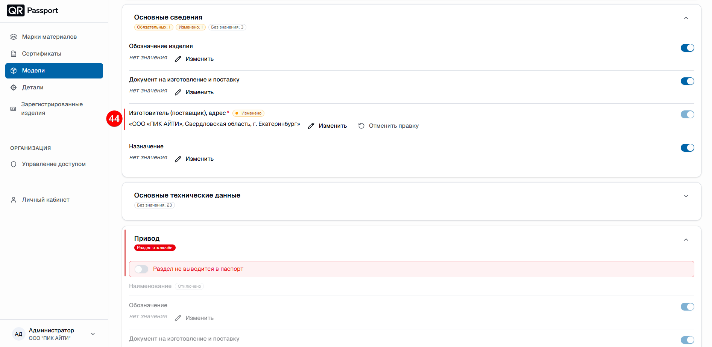

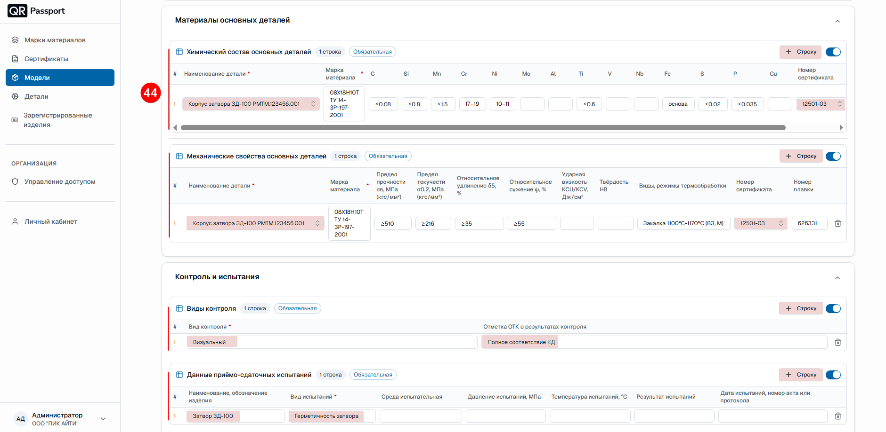

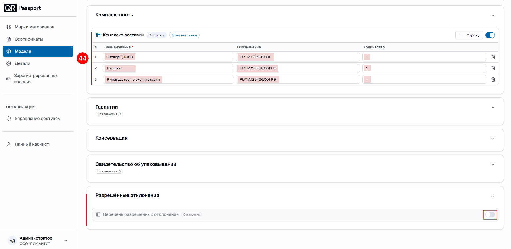

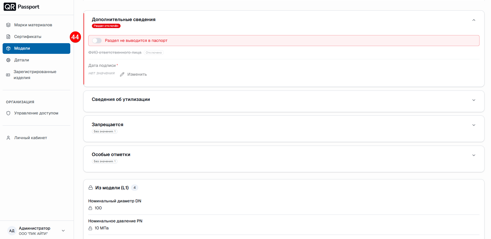

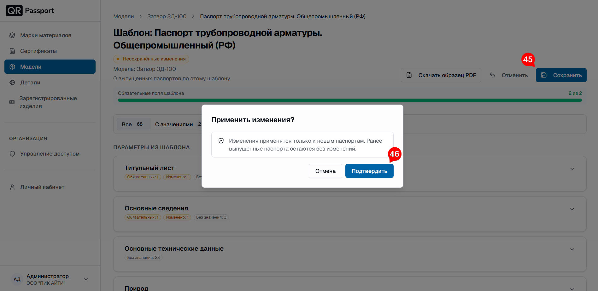



**Результат:** модель _Затвор ЗД-100_ создана, шаблон паспорта настроен – модель готова к регистрации изделий.

### Зарегистрированные изделия

Заключительный этап – регистрация изделия: система выпустит серию с серийными номерами и сгенерирует QR-коды. Для этого выполните следующие шаги:

47. Вернитесь на предыдущую вкладку **Затвор ЗД-100**.
48. Нажмите кнопку **Зарегистрировать изделие**.
49. Проверьте введенные данные и нажмите кнопку **Далее**.
50. Перейдите во вкладку **Серия изделий**.
51. Заполните поля:
    * Префикс – `ЗД-`;
    * Стартовый номер – `001`;
    * Шаг – оставляем 1;
    * Суффикс – `-2026`;
    * Количество – `5`;
    * Дата изготовления (поставки) – `02.02.2026`.
52. Нажмите кнопку **Далее**.
53. Заполните все обязательные даты, например, датой **02.02.2026**.
54. Нажмите кнопку **Зарегистрировать 5 изделий**.



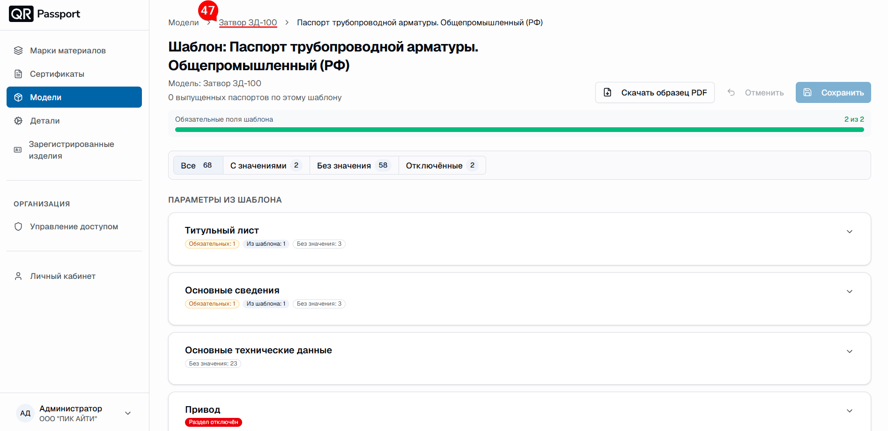

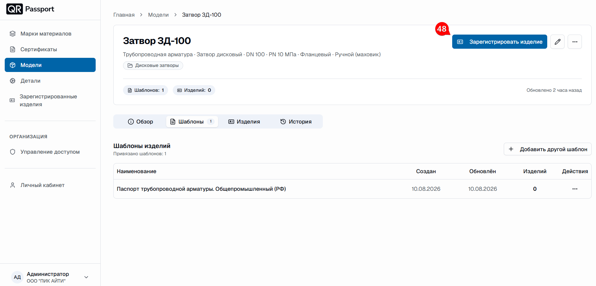

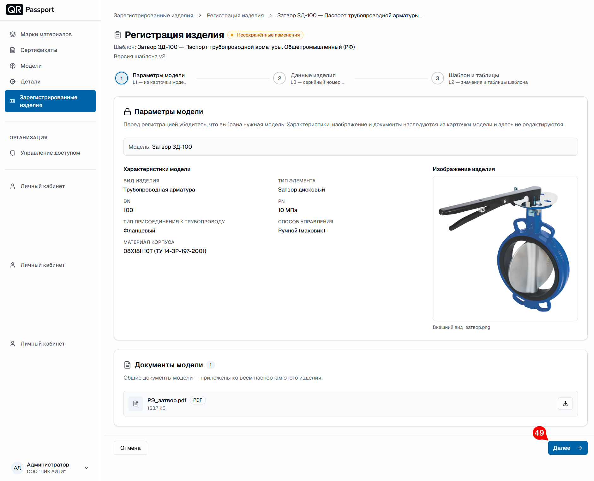

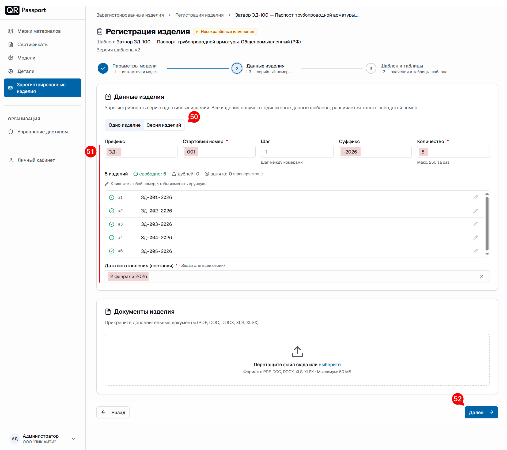

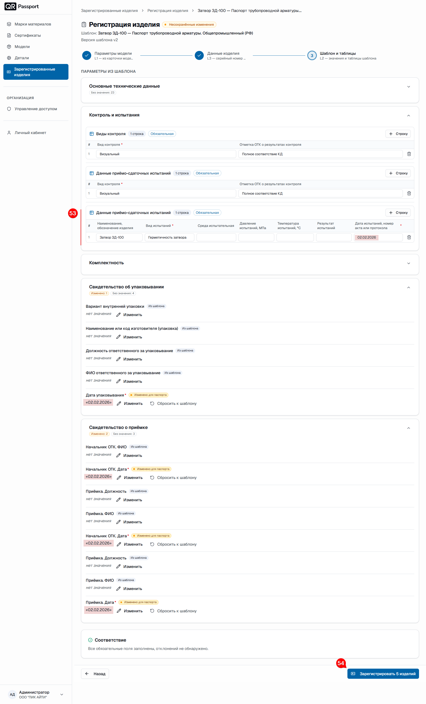



#### Скачивание паспортов и QR-кодов

55. Галочками выберите серийные номера изделий **ЗД-001-2026** – **ЗД-005-2026**.
56. Нажмите кнопку **Скачать**.
57. Выберите **Паспорта и QR-коды (PNG)**.



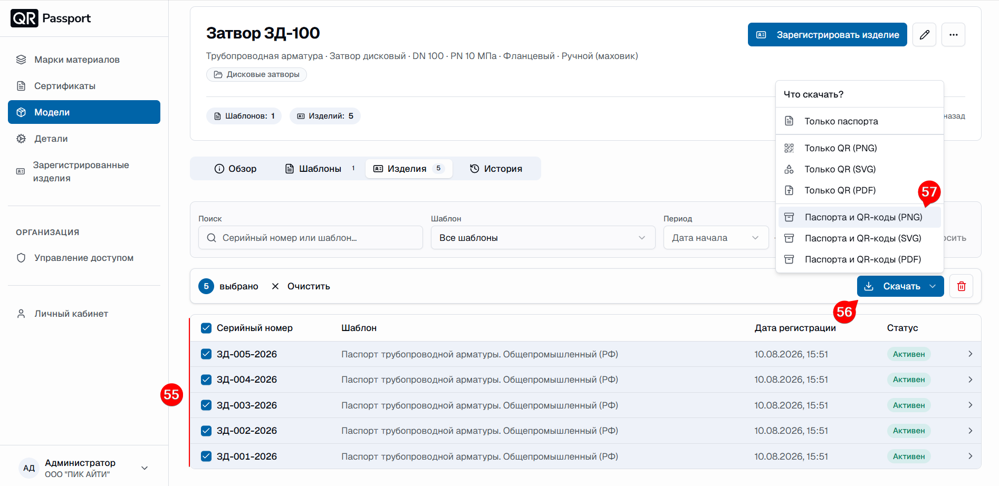





Скачанные паспорта можно открыть и проверить, а скачанные QR-коды – отсканировать и посмотреть получившуюся информацию. В паспорте заполнили только основную информацию; незаполненные поля выглядят как «–» – при желании их можно заполнить или отключить вовсе.



**Результат:** изделия _ЗД-001-2026 – ЗД-005-2026_ зарегистрированы, паспорта и QR-коды скачаны. Задача выполнена.

## Переход к реальной работе

Основные возможности QR-Passport изучены. Перед началом повседневной работы удалите тестовые данные – для этого выполните следующие действия:

1. _Удаление зарегистрированных изделий_
   - Перейдите в раздел **Зарегистрированные изделия**.
   - Галочками выберите серийные номера изделий **ЗД-001-2026** – **ЗД-005-2026**.
   - Нажмите кнопку **Удалить**.
   - Подтвердите удаление словом **Удалить**.

   
   - Нажмите **Удалить 5 изделий**.

2. _Удаление шаблона_
   - Перейдите в раздел **Модели**.
   - Перейдите во вкладку **Шаблоны**.
   - Нажмите «**⋯**» справа.
   - Выберите **Удалить шаблон**.
   - Нажмите **Удалить шаблон**.

3. _Удаление модели_
   - Перейдите в раздел **Модели**.
   - Выберите модель **Затвор ЗД-100**.
   - Нажмите «**⋯**» справа.
   - Выберите **Удалить**.
   - Нажмите **Удалить модель**. 

4. _Удаление группы_
    - В разделе **Модели** напротив группы нажмите «**⋯**» справа.
    - Выберите **Удалить**.
    - Нажмите **Удалить группу**.    

5. _Дальнейшие действия_
    - Изучите остальные разделы инструкции.
    - Приступите к созданию рабочих моделей и регистрации оборудования для повседневной эксплуатации. 

