# Быстрый старт

Инструкция разделена на этапы, выполнение которых позволяет последовательно освоить функционал системы. Каждый этап содержит чёткие шаги и пояснения. Для начала работы рекомендуется ознакомиться с основными понятиями системы и перейти к тестовой модели.

Основные термины QR-Passport собраны в разделе [Основные понятия](concepts.md).

## Активные элементы в инструкции
В инструкции используются активные элементы. Ниже приведены примеры таких элементов и пояснения, как с ними работать.



* **_Текст для копирования_** – чтобы не вводить текст вручную, используйте элементы голубого цвета. Например: «_Введите название группы_ `Редукторы`». Кликните на элемент `Редукторы` и текст скопируется в буфер обмена, после чего вы можете вставить его в нужное поле.

* **_Ссылки для скачивания_** – в разделе есть активные ссылки для скачивания файлов, выглядят они так: «_для тестовой модели используйте пример этого [руководства](./_files/quick_start/manual2.pdf)_». Нажмите на ссылку, чтобы скачать файл для тестовой модели.

* **_Скриншоты шагов_** – после каждой группы действий есть раскрывающийся список со скриншотами шагов. Нажмите на «_см. шаги 1-4_», чтобы развернуть изображения.

    

    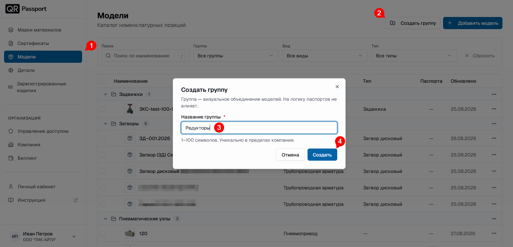

    



## Тестовая модель

**Задача:** выпустить 5 паспортов на редукторы (редуктор четвертьоборотный – РД-100) с серийными номерами РД-001-2026 – РД-005-2026 от 02.02.2026.

Для примера зададим этому редуктору такие характеристики:

- группа – **Редукторы**;
- модель – **Редуктор РД-100** с параметрами:
  - Крутящий момент, Н·м: 675;
  - Среда: масла, сжатый воздух, неагрессивные газы;
  - Тип ISO-фланца: F10/F12;
  - Температура рабочей среды, °С: от минус 30 до плюс 120.



Пример выполняется на тестовых данных. Созданные в ходе руководства модель, изделия и шаблон в конце инструкции рекомендуется удалить.



## Шаги выполнения

### Модели

Создадим структуру оборудования – группу и модель внутри неё, чтобы классифицировать изделие. Для этого выполните следующие шаги:

1. Перейдите в раздел **Модели**.
2. Нажмите кнопку **Создать группу**.
3. Введите название группы `Редукторы` – это название типа оборудования, и его удобно взять за основу структуры.
4. Нажмите кнопку **Создать**.





Далее создаем модель внутри группы. Для этого выполните следующие шаги:

5. Нажмите кнопку **Добавить модель**.
6. Введите название модели – `Редуктор РД-100`.
7. Выберите из выпадающего списка ранее созданную группу – **Редукторы**.
8. Выберите из выпадающего списка вид изделия – **Другое оборудование**.
9. Прикрепите документ – для тестовой модели используйте пример этого [руководства](./_files/quick_start/manual2.pdf).
10. Нажмите кнопку **Создать модель**.



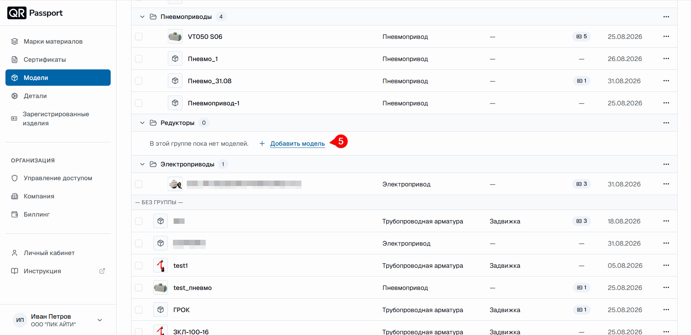
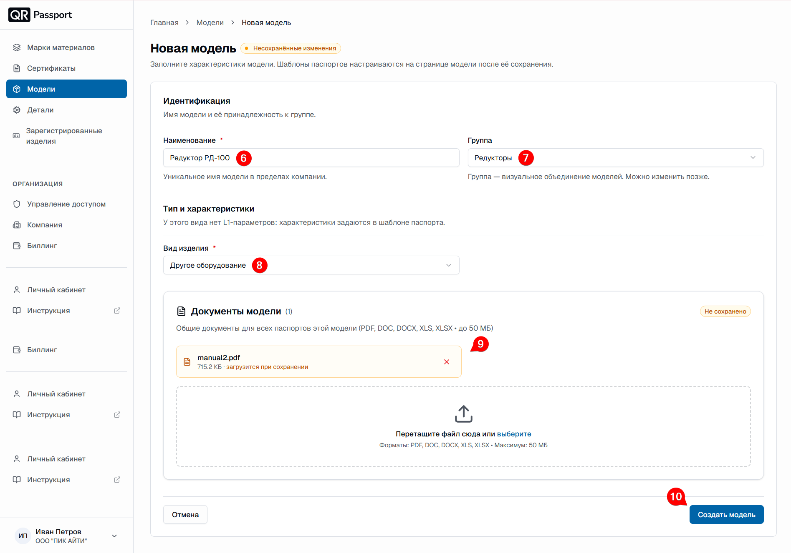



11. Загрузите изображение модели – для тестовой модели используйте это [изображение](./_files/quick_start/model2.png).
12. Перейдите во вкладку **Шаблоны**.
13. Нажмите кнопку **Добавить другой шаблон**.



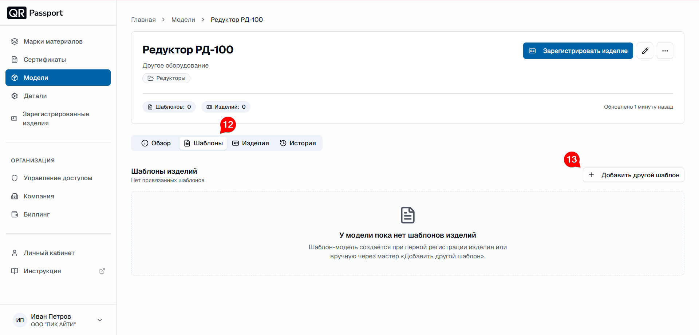



14. В появившемся окне выберите из списка шаблон – «Паспорт изделия (РФ)».
15. Заполните некоторые поля, например:
    - Титульный лист: прикрепите логотип – для тестовой модели используйте этот [логотип](./_files/quick_start/logo.png);
    - Титульный лист: введите наименование изделия – `Редуктор РД-100` → нажмите ниже **Готово**;
    - Титульный лист: введите обозначение паспорта – `РМТМ.123456.001 ПС` → нажмите ниже **Готово**;
    - Основные сведения: введите изготовителя – `ООО «ПИК АЙТИ», Свердловская область, г. Екатеринбург` → нажмите ниже **Готово**;
    - Основные технические данные: нажмите кнопку **«+ Строку»** и добавьте строки из таблицы:

      | Наименование параметра | Значение |
      |---|---|
      | `Крутящий момент, Н·м` | `675` |
      | `Среда` | `масла, сжатый воздух, неагрессивные `газы` |
      | `Тип ISO-фланца` | `F10/F12` |
      | `Температура рабочей среды, °С` | `от минус 30 до плюс 120` |



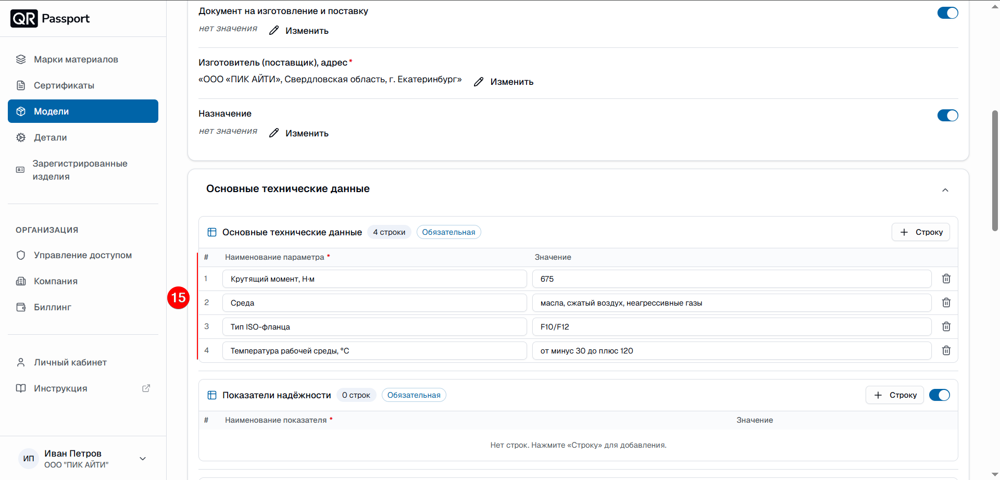
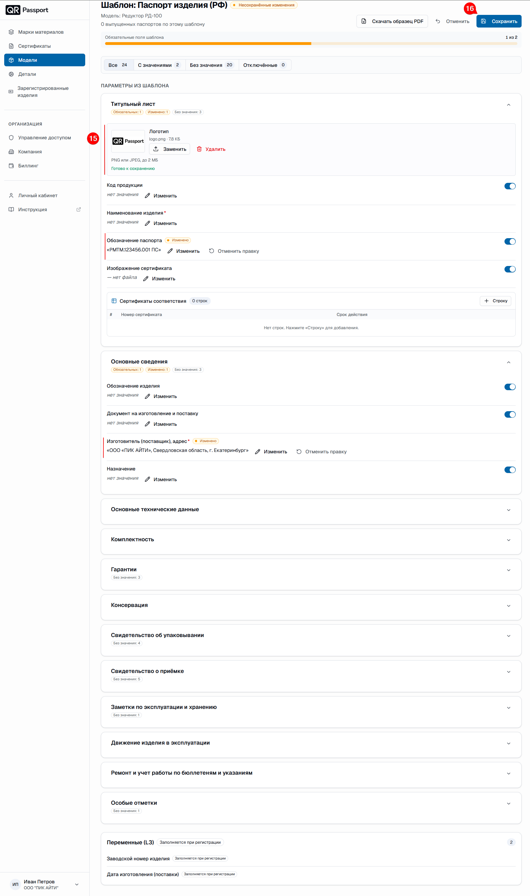



16. Нажмите кнопку **Сохранить**.
17. Нажмите кнопку **Подтвердить**.

**Результат:** модель _Редуктор РД-100_ создана, шаблон паспорта настроен – модель готова к регистрации изделий.

### Зарегистрированные изделия

Заключительный этап – регистрация изделия: система выпустит серию с серийными номерами и сгенерирует QR-коды. Для этого выполните следующие шаги:

18. Вернитесь на предыдущую вкладку **Редуктор РД-100**.
19. Нажмите кнопку **Зарегистрировать изделие**.



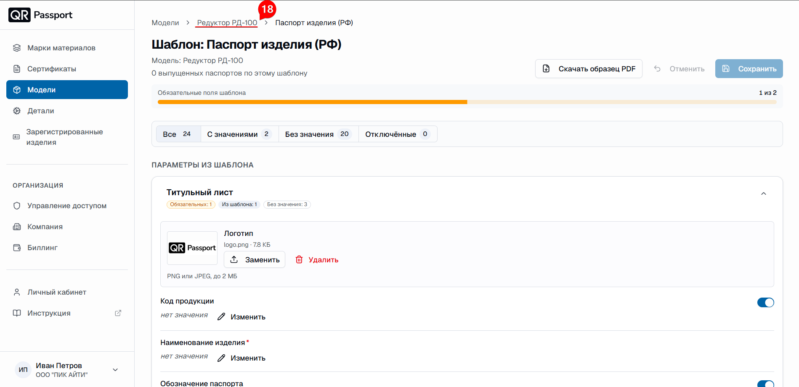
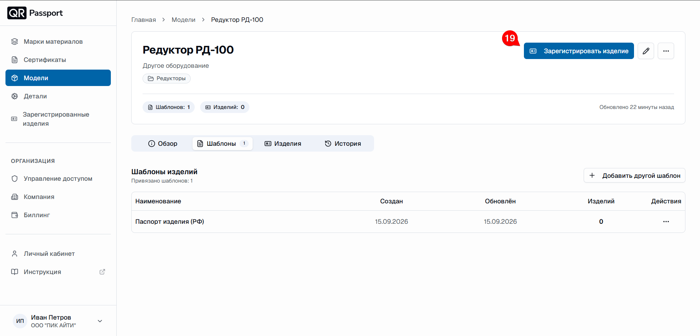



20. Проверьте введённые данные и нажмите кнопку **Далее**.
21. Перейдите во вкладку **Серия изделий**.
22. Заполните поля:
    - Префикс – `РД-`;
    - Стартовый номер – `001`;
    - Шаг – оставляем 1;
    - Суффикс – `-2026`;
    - Количество – `5`;
    - Дата изготовления (поставки) – `02.02.2026`.
23. Нажмите кнопку **Далее**.



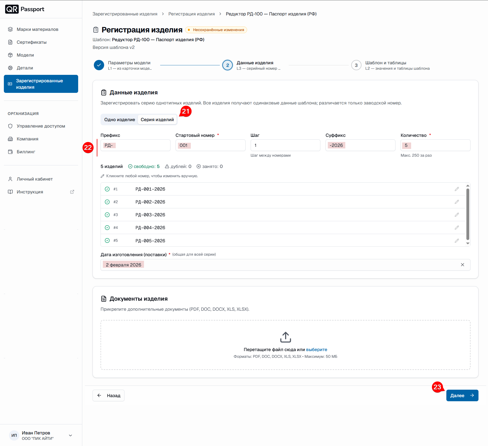



24. Заполните все обязательные даты, например, датой **02.02.2026**.
25. Нажмите кнопку **Зарегистрировать 5 изделий**.



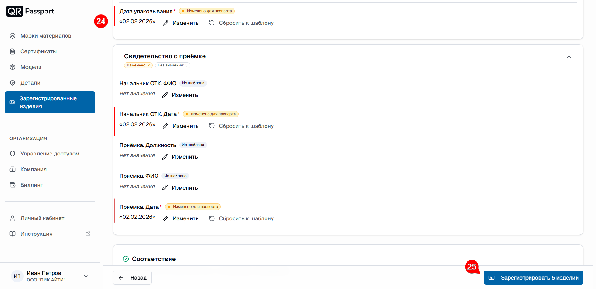



#### Скачивание паспортов и QR-кодов

26. Галочками выберите серийные номера изделий **РД-001-2026** – **РД-005-2026**.
27. Нажмите кнопку **Скачать**.
28. Выберите **Паспорта и QR-коды (PNG)**.



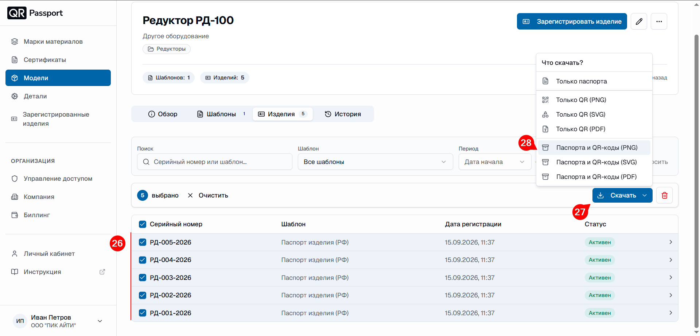





Скачанные паспорта можно открыть и проверить, а скачанные QR-коды – отсканировать и посмотреть получившуюся информацию. В паспорте заполнили только основную информацию; незаполненные поля выглядят как «–» – при желании их можно заполнить или отключить вовсе.



**Результат:** изделия _ЗД-001-2026 – ЗД-005-2026_ зарегистрированы, паспорта и QR-коды скачаны. Задача выполнена.

## Переход к реальной работе

Основные возможности QR-Passport изучены. Перед началом повседневной работы удалите тестовые данные – для этого выполните следующие действия:

1. _Удаление зарегистрированных изделий_
   - Перейдите в раздел **Зарегистрированные изделия**.
   - Галочками выберите серийные номера изделий **РД-001-2026** – **РД-005-2026**.
   - Нажмите кнопку **Удалить**.
   - Подтвердите удаление словом **Удалить**. 
   - Нажмите **Удалить 5 изделий**.

2. _Удаление шаблона_
   - Перейдите в раздел **Модели**.
   - Перейдите во вкладку **Шаблоны**.
   - Нажмите «**⋯**» справа.
   - Выберите **Удалить шаблон**.
   - Нажмите **Удалить шаблон**.

3. _Удаление модели_
   - Перейдите в раздел **Модели**.
   - Выберите модель **Редуктор РД-100**.
   - Нажмите «**⋯**» справа.
   - Выберите **Удалить**.
   - Нажмите **Удалить модель**. 

4. _Удаление группы_
    - В разделе **Модели** напротив группы нажмите «**⋯**» справа.
    - Выберите **Удалить**.
    - Нажмите **Удалить группу**.    

5. _Дальнейшие действия_
    - Изучите остальные разделы инструкции.
    - Приступите к созданию рабочих моделей и регистрации оборудования для повседневной эксплуатации. 