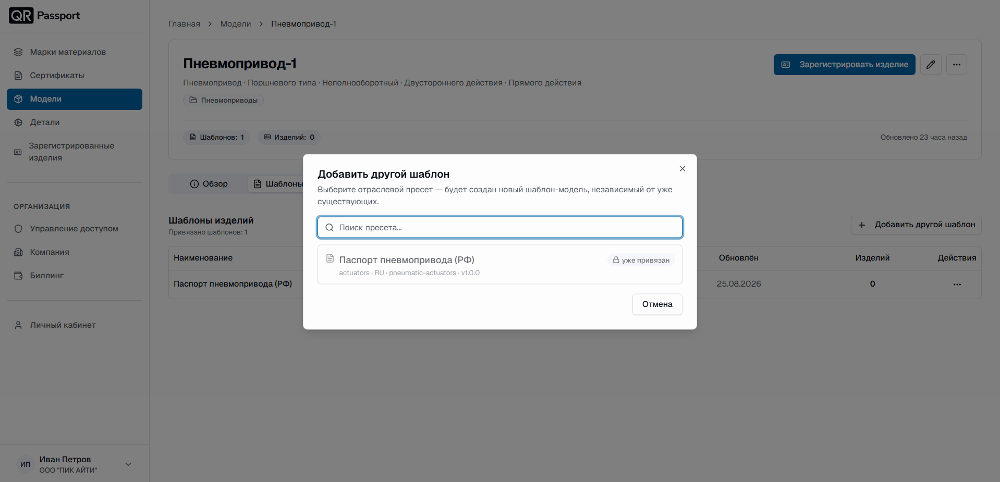
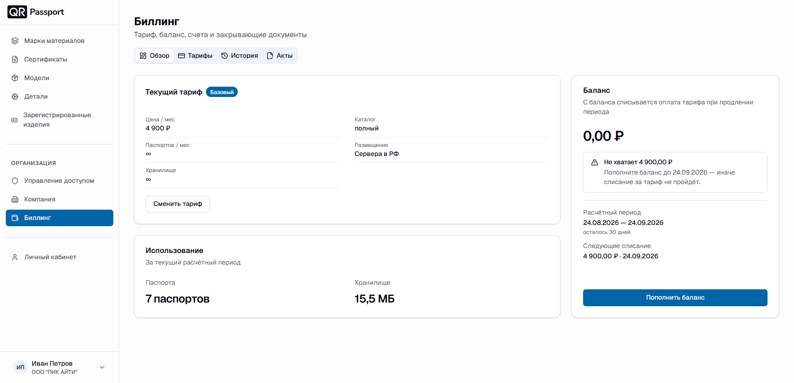

  <a href="/ru/">Главная</a> / История изменений

# История изменений

Здесь рассказываем, что нового появляется в QR-Passport и что мы улучшили. Новые записи – сверху.

### Август 2026



**Новое.** Добавлен отраслевой шаблон «Паспорт пневмопривода (РФ)» по СТ ЦКБА 031-2015. Теперь в каталоге доступны шаблоны не только на трубопроводную арматуру, но и на пневмоприводы.

Шаблон можно выбрать при [создании модели](equipment/models/create_model.md).





**Новое.** В разделе **Организация** появился подраздел [Биллинг](organization/billing.md) – тариф, баланс, счета и закрывающие документы организации. Администратор может сравнивать и менять тарифы, пополнять баланс, отслеживать счета и получать акты за оплаченные периоды.

Подраздел доступен только пользователям с уровнем доступа **Администратор**.



### Июль 2026



**Улучшение.** При [создании модели](equipment/models/create_model.md) теперь доступны новые отраслевые пресеты – **Атомные станции (РФ)** и **Нефтяная и нефтехимическая промышленность (РФ)**.

Паспорт, созданный по такому шаблону, сразу соответствует требованиям, которые предъявляются к изделиям, поставляемым на атомные станции и в нефтяную и нефтехимическую промышленность.

