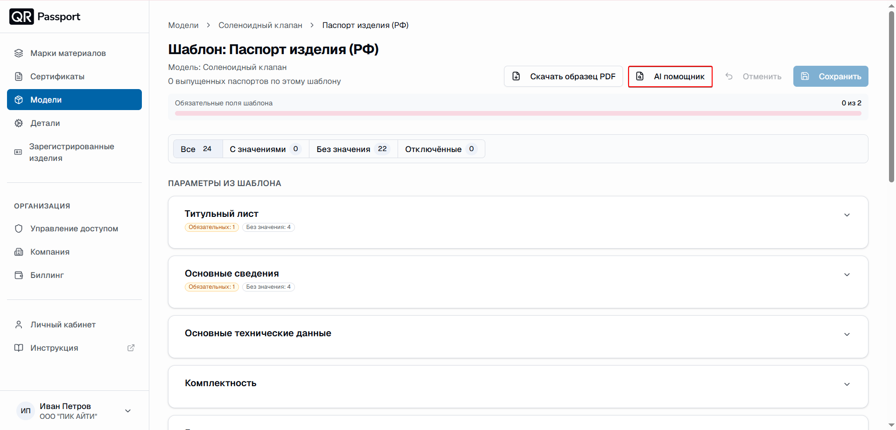
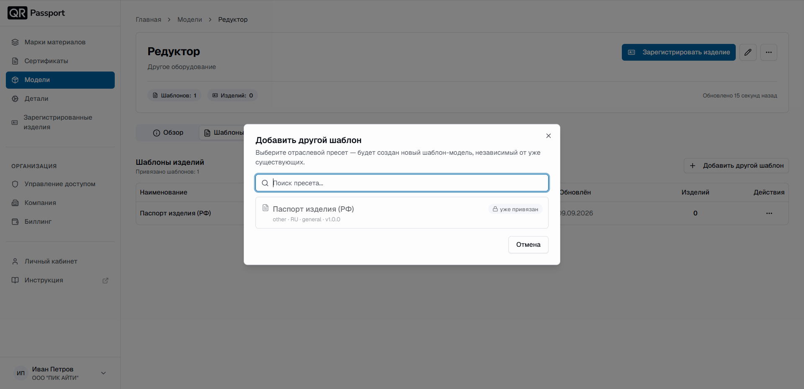
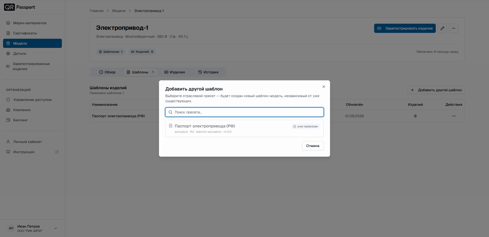
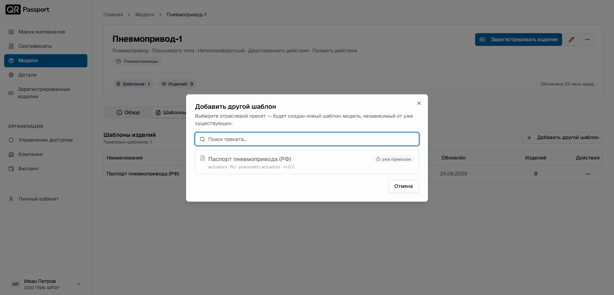
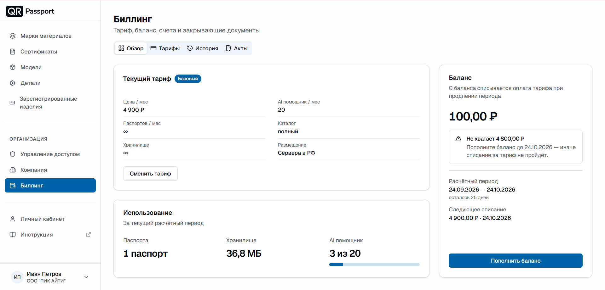
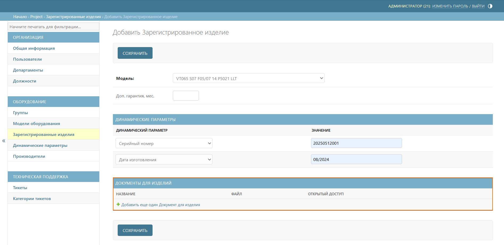

  <a href="/ru/">Главная</a> / История изменений

# История изменений

Здесь рассказываем, что нового появляется в QR-Passport и что мы улучшили. Новые записи – сверху.

### Октябрь 2026



**Новое.** На странице шаблона появилась кнопка **«AI помощник»** – загрузите готовый технический паспорт изделия (PDF, DOCX, JPG или PNG до 25 МБ), и ИИ распознает данные и предложит значения для полей и таблиц шаблона в QR-Passport. Результат можно проверить по вкладкам, отредактировать и перенести в шаблон – заполнять с нуля шаблон не нужно.

Текущий лимит и использованное количество распознаваний видны в разделе **«Биллинг → Обзор»** (строка «AI помощник / мес» в карточке тарифа и счётчик в блоке «Использование»). Лимит обнуляется с началом каждого нового расчётного периода.



### Сентябрь 2026



**Новое.** Добавлен общий шаблон [«Паспорт изделия (РФ)»](https://docs.qrpassport.tech/ru/equipment/models/templates/other_equipment.html) по ГОСТ Р 2.610-2019. Разделы шаблона можно включать и отключать под ваше изделие. Шаблон можно выбрать при [создании модели](equipment/models/create_model.md).





**Новое.** Добавлен отраслевой шаблон [«Паспорт электропривода (РФ)»](https://docs.qrpassport.tech/ru/equipment/models/templates/electric_drives.html) по ГОСТ 34610-2019 и ГОСТ Р 2.610-2019. Шаблон можно выбрать при [создании модели](equipment/models/create_model.md).





**Новое.** Добавлен отраслевой шаблон [«Паспорт пневмопривода (РФ)»](https://docs.qrpassport.tech/ru/equipment/models/templates/pneumatic_drives.html) по СТ ЦКБА 031-2015 и ГОСТ Р 2.610-2019. Шаблон можно выбрать при [создании модели](equipment/models/create_model.md).





**Новое.** В разделе **Организация** появился подраздел [Биллинг](organization/billing.md) – тариф, баланс, счета и закрывающие документы организации. Администратор может сравнивать и менять тарифы, пополнять баланс, отслеживать счета и получать акты за оплаченные периоды.

Подраздел доступен только пользователям с уровнем доступа **Администратор**.



### Июль 2026



**Улучшение.** При [создании модели](equipment/models/create_model.md) теперь доступны новые отраслевые пресеты – **Атомные станции (РФ)** и **Нефтяная и нефтехимическая промышленность (РФ)**.

Паспорт, созданный по такому шаблону, сразу соответствует требованиям, которые предъявляются к изделиям, поставляемым на атомные станции и в нефтяную и нефтехимическую промышленность.

